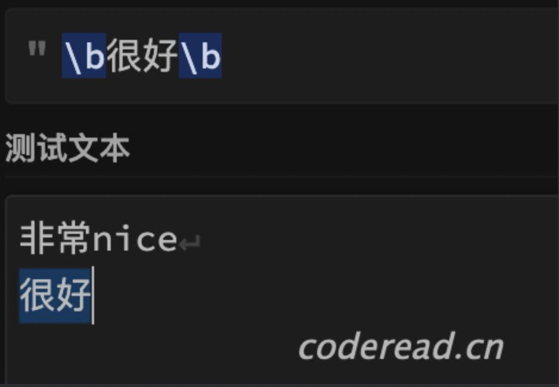
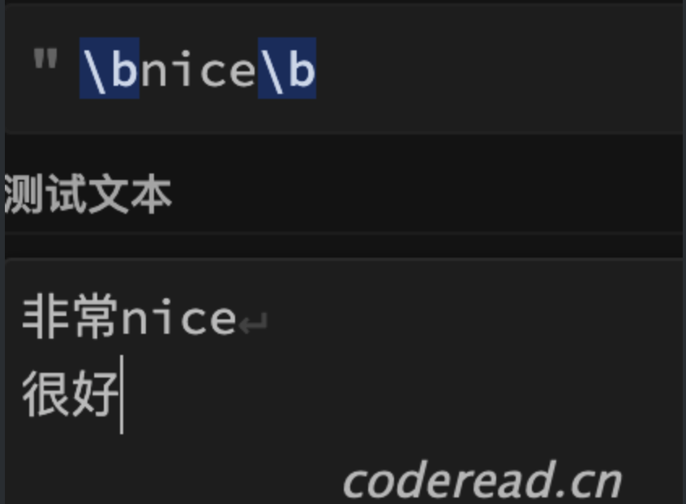

# 正则表达式(5)

# 一. 什么是特殊边界

前面学习了边界断言，通过断言表达式前后的内容，来决定是否匹配。但在一些特殊场景中断言无法进行，比如断言**文本开头**，目前所学正则没有一个字符可用来表示文本开头，自然无法进行断言。

但这类使用场景是真实存在的，而且还很频繁。比如：判断一段文本是否以"hello"开头。为了实现这类需求，正则中用`^` 表示文本的开头，它是一个特殊边界断言，`^hello`即匹配"hello"字符，并且它在文本的开头。

> `^` 这里并不表示某个具体字符，而是一个**后置断言**，断言为文本的开头。`^hello`等价于`(?<=^)Hello`,你可以认为`^`相当于是`(?<=^)`简写。就像`*`是`{0,}`简写一样。

匹配文本中开头的Hello：

```
^Hello
```

```
Hello 你好
it's me 是我
I was wondering 我在想 
if after all these years 这么多年过去
You'd like to meet to go over everything 你是否愿意还见我，回想起
Hello 你好
can you hear me 听得到我吗

```

## 1.1 定义

在正则中的文本边界、行边界、单词边界即为特殊边界断言，本质上还是**边界断言**，用于计算出布尔值，并且也不消耗字符。其语法如下表：

| 语法               | 描述                                                      | 兼容性            |
| :----------------- | :-------------------------------------------------------- | :---------------- |
| `^` 文本开头       | 默认情况下，表示断言文本开头                              |                   |
| `$`文本结尾        | 默认情况下，表示断言文本结尾                              |                   |
| `^` 行开头         | 被`m`修饰后，`^`表示行的开头，等价于`(?<=\n|\A)`          |                   |
| `$` 行结尾         | 被`m`修饰后，`$`表示行的结尾,等价于`(?=\n|\Z)`            |                   |
| `\A` 文本开头      | 断言文本开头                                              | Javascript 不支持 |
| `\Z` 文本结尾      | 断言文本结尾                                              | Javascript 不支持 |
| `\b`单词开头或结尾 | 断言单词开头或结尾                                        |                   |
| `\B`               | `\b` 否定式,非单词开头或结尾 ，等价于`(?<!\b)` 或`(?!\b)` |                   |

> `m`是一个行边界修饰符，它决定`^$`匹配机制，加入`m`表示行边界，否则就是文本边界。

由于特殊边界断言，都是单个元字符表示，很容易认人误解成是普通字符，常见误区就像`\b` 理解成单词分割空格，或把 `^` 误解成行的分割`\n`。事实上它们只是断言，是不会消耗字符的。

# 二. 文本边界

文本边界，即整个字符串开始与结束位置，它有两种表示方式：`\A` `\Z`和 `^` `$` 都分别断言为开头和结尾。遗憾的是`\A` `\Z`在javascript中不支持，`^ $` 有时又要用来表示行的开头和结尾，真是太难为开发者了。

为什么会这样呢？因为正则开发之初就是为单行做匹配的，行边界即文本边界，用`^ $`表示没毛病，后来正则支持匹配多行了，`^ $` 产生了歧义所以用`m`修饰符加以修正。

为了避免混淆，我建议如果是做单行匹配，全部用`^$`表示行边界和文本边界。如果是多行尽量用`\A\Z`表文本边界，用`^$`表示行边界。

> 由于本教程是基于javascript引擎，所以只能用 `^$` 表示文本边界。

## 2.1 案例

接下来基于文本边界，实现一个删除文本前后空白行的案例：

删除代码前后的空白行，类似字符串的`trim()`操作：

```
^\s+|\s+$
```

```java

public class Main {
   public static void main(String[] args) throws IOException {
       System.out.println("开始执行:请输入你的年龄");
       System.in.read();
       System.out.println("开始执行");
   }
}      

```

# 三. 行边界

行边界，文本中每行的开始和结束位置，分别使用`^`和`$`表示,同时得还得加上行边界修饰符`m`。

- `^`是一个简写后置断言，相当于`(?<=\n)` ，断言表达式后置必须是**换行符**，但这两者又不能完全等价，因为在文本开头，即使没有`\n` `^`也能匹配。
- `$`是一个简写的前置断言，相当于`(?=\n)`,断言表达式前置必须是**换行符**，但这两者又不能完全等价，因为在文本结尾，即使没有`\n` `$`也能匹配。

在 javascipt 中**没有**`\A` 和`\Z` ，如果需要同时表达**文本**边界，与**行**边界如何做呢？可以这么实现，在未加`m`修饰情况下， 用`^` `$`表示文本边界，用`(?<=\n|^)`与`(?=\n|$)`分别表示行首、行尾即可。

## 3.1 案例

找出长度8至20之间的行：

```
/^.{8,20}$/gm
```

提示：必须添加修饰符`m`。

> 在网上拷贝正则案例的时候，经常会看到`^` `$` ,很多同学只是简单理解成开头与结尾，你现应该知道只有在匹配单行字符串时可以这么理解，而多行时就得看有没有用行边界修饰符`m`。

# 四. 单词边界

`\b`是一个极为特殊的边界断言，它既断言单词开头，也断言单词的结尾。当我们需要匹配**完整单词**的就需要使用它：比如匹配this is uncle中is，如果直接用`is`匹配结果就是：th==i==s ==is== uncle。正确写法是`\bis\b` ，前后两个`\b`分别表示单词开头与结尾。

## 4.1 定义

单词边界本质上还是一个边界断言，符合边界断言所有特性：计算布尔值、不消耗字符等。`\b`断言单词的前后是一个`\W`字符，或是一个其它边界（行边界，文本边界）。

以下两个表达式：`\bhello\b` 与`(?<=^|\W|\A)Hello(?=$|\W|\Z)` 希望能助你理解`\b`本质，

## 4.2 \b兼容性

在java 与python中 `\b` 支持Unincode 汉字 ，如：`\b很好\b` 可以匹配下文：



但这也有弊端，比如想要匹配上文中的`\bnice\b`就无法匹配，因为它认为汉字不是单词的分割。



## 4.3 案例

找出文中所有以ing结尾的单词：

```
\w+ing\b
```

```
1.An engaged woman is always more agreeable than a disengaged. She is satisfied with herself. Her cares are over, and she feels that she may exert all her powers of pleasing without suspicion.
订了婚的女人最可爱了。她什么都满足了，什么忧虑都消散了，她可以大大方方去讨好自己未来的老公，而无需担心人家以为她在玩暧昧。

2.A woman, especially, if she have the misfortune of knowing anything, should conceal it as well as she can.
一个女人要是不幸聪明得什么都懂，那就必须同时懂得怎么伪装成什么都不懂。

3.To see a young couple loving each other is no wonder: but to see an old couple lovingeach other is the best sight of all.
看见一对年轻人相亲相爱不足为奇，然而看到一对这样的老人确是人间最美的景致。
```

# 五. 常见案例

## 5.1 非法用户名称

匹配出**非法**的用户昵称：

```
^(?=(?=\s+$)|(?!.{2,30}$)|(?=.*\b(av|sb|fuck)\b.*)).+
```

非法昵称定义如下：

- 全部都是空白字符
- 名字超过 30 个字符,或少于 2 个字符
- 包含敏感单词：av|sb|fuck

满足任何一条即非法昵称。
此题可借鉴前面关于合法密码的解题思路

```
三大sb
av my homework
       
1234567890123456789012345678901234567890
save the world
ASB
asbest
$fuck$
sfuckaaaa
```
