# Git(1)

# 一. 简介

## 1.1 什么是Git

Git 是一个免费的、开源的分布式版本控制系统，可以快速高效地处理从小型到大型的项目，它是由 Linux 之父 Linus Torvalds 为了管理 Linux 不同版本的源代码而开发的。

## 1.2 什么是版本控制

版本控制是一种记录一个或若干文件内容变化，以便将来查阅特定版本修订情况的系统 。 

## 1.3 为什么要版本控制

软件开发中采用版本控制系统是个明智的选择。 有了它你就可以将某个文件回溯到之前的状态,甚至将整个项目都回退到过去某个时间点的状态。 就算你乱来一气把整个项目中的文件改的改删的删，你也照样可以轻松恢复到原先的样子。 但额外增加的工作量却微乎其微。你可以比较文件的变化细节,查出最后是谁修改了哪个地方，从而找出导致怪异问题出现的原因，又是谁在何时报告了某个功能缺陷等等。 

## 1.4 版本控制系统的分类

1. 集中化的版本控制系统：

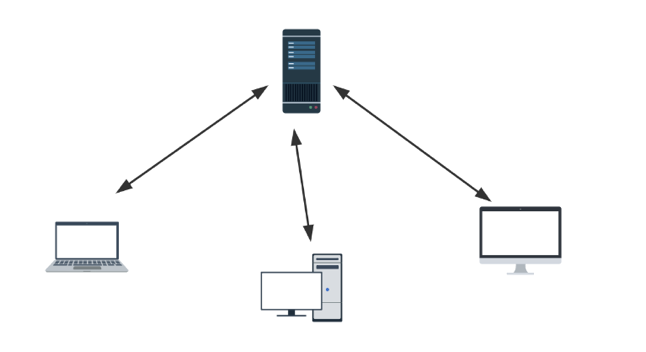

集中化的版本控制系统诸如 CVS、SVN 以及 Perforce 等，都有一个单一的集中管理的服务器,保存所有文件的修订版本，而协同工作的人们都通过客户端连到这台服务器,取出最新的文件或者提交更新。多年以来,这已成为版本控制系统的标准做法,这种做法带来了许多好处,现在,每个人都可以在一定程度上看到项目中的其他人正在做些什么。而管理员也可以轻松掌控每个开发者的权限，并且管理一个集中化的版本控制系统;要远比在各个客户端上维护本地数据库来得轻松容易。 事分两面，有好有坏。这么做最显而易见的缺点是中央服务器的单点故障。如果服务器宕机一小时，那么在这一小时内， 谁都无法提交更新，也就无法协同工作。 

2. 分布式的版本控制系统：

由于上面集中化版本控制系统的那些缺点，于是分布式版本控制系统面世了。 在这类系统中，像 Git, BitKeeper 等，客户端并不只提取最新版本的文件快照，而是把代码仓库完整地镜像下来。 

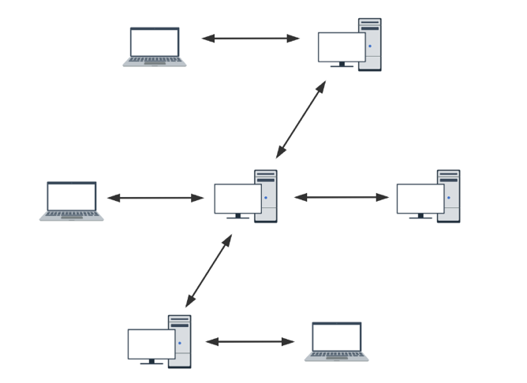

更进一步，许多这类系统都可以指定和若干不同的远端代码仓库进行交互。这样，你就可以在同一个项目中分别和不同工作小组的人相互协作。 

分布式的版本控制系统在管理项目时存放的不是项目版本与版本之间的差异，它存的是索引(所需磁盘空间很少所以每个客户端都可以放下整个项目的历史记录) 。

# 二. 安装

Git官网： https://git-scm.com/ ，点击进入官网下载安装包自动安装即可。

# 三. 代码托管中心

代码托管中心是干嘛的呢？ 它的任务是帮我们维护远程库， 下面说一下本地库和远程库的交互方式，也分为两种： 

1. 团队内部协作：

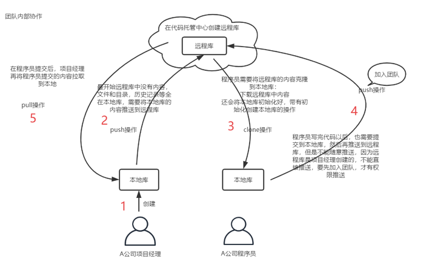

2. 跨团队协作：

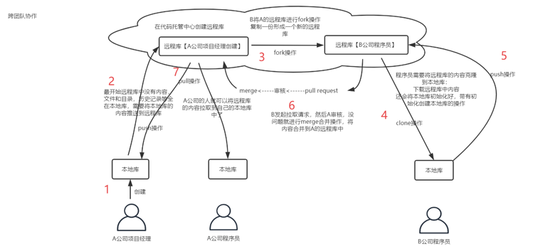

托管中心种类： 

1. 局域网环境下：  可以搭建 GitLab 服务器作为代码托管中心，GitLab 可以自己去搭建。
2. 外网环境下：可以由 GitHub 或者 Gitee 作为代码托管中心，GitHub 或者 Gitee 是现成的托管中心，不用自己去搭建。

# 四. Git常用操作

## 4.1 初始化本地仓库

1. 创建一个文件夹，随便起名字比如叫 **git-repository-demo**。
2. 输入命令初始化仓库：

```shell
git init
```

这时候会在文件夹内生成一个 `.git` 文件夹，这个是隐藏的文件，MacOS系统可以使用快捷键 ⇧ ⌘ . 组合显示隐藏的文件。

## 4.2 Git常用命令

1. 查看 git 版本：

```shell
git --version
```

2. 清屏：

```shell
clear
```

3. 设置签名：

```shell
git config --global user.name "JetFly"          # 全局用户名
git config --global user.email "xxx@gmail.com"  # 全局邮箱
```

4. 添加文件，提交文件：

```shell
git add demo.txt  # 添加demo.txt到本地git仓库暂存区中
git commit demo.txt  # 提交demo.txt到本地仓库中
```

注意：不放在本地仓库中的文件，git 不进行管理。即使放在本地仓库的文件，git 也不管理，必须通过 **add** **commit** 命令操作才可以将内容提交到本地库。

5. 查看工作区和暂存区的状态：

```shell
git status
# 在主分支上，若没有要提交的会提示以下内容
On branch master
nothing to commit,working tree clean
```

6. 查看日志：

```shell
git log  # 查看提交的，显示从最近到最远的日志
```

当历史记录过多的时候，查看日志的时候，有分页效果，分屏效果，一页展示不下，可以使用快捷键翻页：

- 下一页：␣
- 上一页：b
- 退出：q

到尾页会显示 **(END)**。

```shell
git log --pretty=oneline  # 一行展示一条log
git log --oneline  # 同上
34a0e45 (HEAD -> master) Merge branch 'dev'
8d359a7 go
b14793a (dev) go
9a0029d go
abef71a words
10fe171 go
5118129 jdbc
360ee7f jdbc
4b6901e hello world
```

```shell
git reflog
34a0e45 (HEAD -> master) HEAD@{0}: merge dev: Merge made by the 'ort' strategy.
8d359a7 HEAD@{1}: commit: go
9a0029d HEAD@{2}: checkout: moving from dev to master
b14793a (dev) HEAD@{3}: commit: go
9a0029d HEAD@{4}: checkout: moving from master to dev
9a0029d HEAD@{5}: checkout: moving from dev to master
9a0029d HEAD@{6}: checkout: moving from master to dev
9a0029d HEAD@{7}: commit: go
abef71a HEAD@{8}: commit: words
10fe171 HEAD@{9}: commit: go
5118129 HEAD@{10}: reset: moving to 5118129
0d5b41a HEAD@{11}: commit: removed
360ee7f HEAD@{12}: reset: moving to 360ee7f
5118129 HEAD@{13}: commit: jdbc
360ee7f HEAD@{14}: commit: jdbc
4b6901e HEAD@{15}: commit (initial): hello world
```

这条命令的输出多了信息：HEAD@{数字}，这个数字的含义：指针回到当前这个历史版本需要走多少步。

7. 回退版本：

```shell
git reset --hard 5118129
```

使用这个命令可以前进或者后退历史版本。

```shell
git reset --hard [index]  # 本地库的指针移动的同时，重置暂存区，重置工作区
git reset --mixed [index] # 本地库的指针移动的同时，重置暂存区，但是工作区不动
git reset --soft [index]  # 本地库的指针移动的时候，暂存区，工作区都不动
```

以后用的多的就是  第一种 hard 参数。

8. 比较版本差异：

```shell
git diff [index] main.go
diff --git a/main.go b/main.go
index 4e309e9..cecfc68 100644
--- a/main.go
+++ b/main.go
@@ -1,4 +1,8 @@
+package main

+import (
+    "fmt"
+)
 func main() {
     fmt.Println("HelloWorld")
 }
```

这条命令可以将工作区中的文件和暂存区中文件进行比较。

比较暂存区和本地库中差别： 

```shell
git diff [history] [file]
```

## 4.3 分支

### 4.3.1 什么是分支

在版本控制过程中，使用多条线同时推进多个任务。这里面说的多条线，就是多个分支。

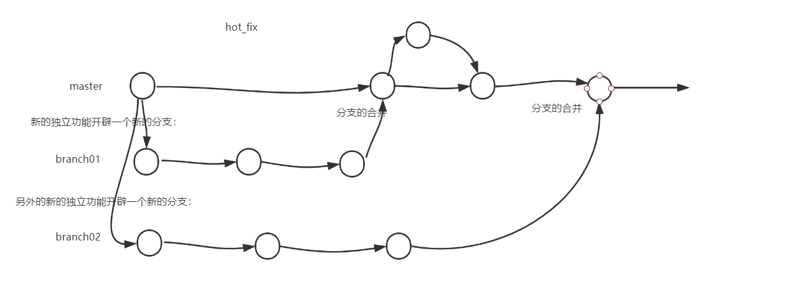

同时多个分支可以并行开发，互相不耽误，互相不影响，提高开发效率。如果有一个分支功能开发失败，直接删除这个分支就可以了，不会对其他分支产生任何影响。 

### 4.3.2 操作分支

1. **查看分支：**

```shell
git branch -v
```

2. **创建分支：**

```shell
git branch dev  # 创建dev分支
```

再查看一下分支：

```shell
  dev    b14793a go
* master 34a0e45 Merge branch 'dev'  # *号表示你当前在哪个分支上
```

3. **切换分支：**

```shell
git checkout dev  # 切换到dev分支
```

4. **处理合并分支冲突：**

假如你在 dev 分支创建了一个文件并修改了里面内容，提交到本地库中。你又在 master 分支也创建了同样的分支，也修改里面内容，最后提交。把 dev 分支的内容合并到主分支：

```shell
git merge dev  # 在master分支下操作
```

这时就会发现有冲突，需要先解决冲突才可以合并，可以公司内部商议解决，或者自己决定人为决定，留下想要的即可。

## 4.4 创建远程库

创建与远程仓库直接进入 gitee 或者 github 个人主页根据提示创建即可：

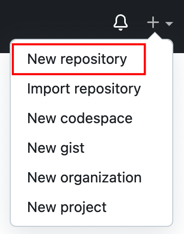

创建完成之后，仓库会生成仓库的地址，但是地址很长，通常会起一个别名，输入以下命令起别名：

```shell
git remote add origin https://github.com/jetfly/git-repository-demo.git
```

**origin** 是约定俗成的默认仓库别名。

输入以下命令可以查看远程仓库别名：

```shell
git remote -v
origin https://github.com/jetfly/git-repository-demo.git (fetch)
origin https://github.com/jetfly/git-repository-demo.git (push)
```

一个是拉取的地址，另一个是推送的地址。

输入推送命令可以提交代码到远程仓库：

```shell
git push origin master  # 推送到origin的master分支
```

同样也可以拉取远程仓库代码：

```shell
git pull origin master  # 拉取origin的master分支，相当于fetch+merge
```

输入克隆命令可以克隆远程仓库代码：

```shell
git clone https://...
```

克隆操作可以帮我们完成： 

1. 初始化本地库。
2. 将远程库内容完整的克隆到本地。
3. 替我们创建远程库的别名。

假如在远程推送的时候遇到了冲突，那么必须要先拉去远程仓库的代码处理冲突，然后再提交，简单来讲就是先 pull，再 push。

# 五. SSH免密登录

进入到用户主目录：

```shell
cd ~
```

执行命令生成 **.ssh** 目录：

```shell
ssh-keygen -t rsa -C xxx@gmail.com
```

邮箱是 Github 账号的邮箱，三次回车确认默认值即可。

在 **.ssh** 目录下有一个 **id_rsa.pub** 文件，打开并复制里面的内容，然后打开 Github 账户的 settings 页面，点击 `SSH and GPG keys` 页面，点击 **New SSH key** 按钮，进入 SSH keys 设置页面。

Title 输入框里面输入名称，名称随便起，Key 输入框里面粘贴刚才复制的内容。生成密钥以后，就可以正常进行 push 操作了。

对 SSH 地址起别名：

```shell
git remote add origin_ssh git@github.com:xxxx/xxx.git
```

# 六. IDEA集成Git

## 6.1 配置Git

首先在 Version Control 选项里面配置一下 Git：

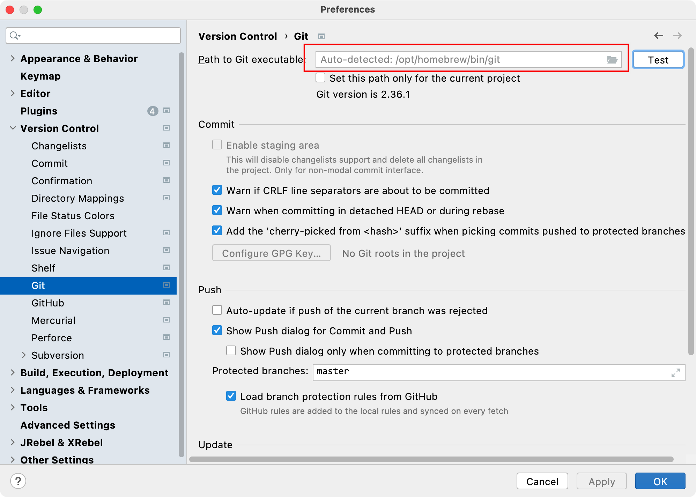

点击导航条 VCS，初始化一个仓库：

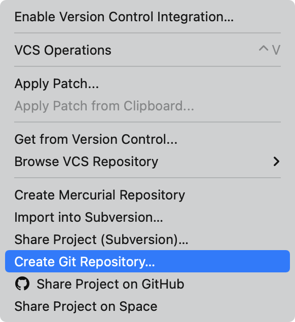

选择当前项目目录即可。

添加到暂存区，再提交到本地仓库：

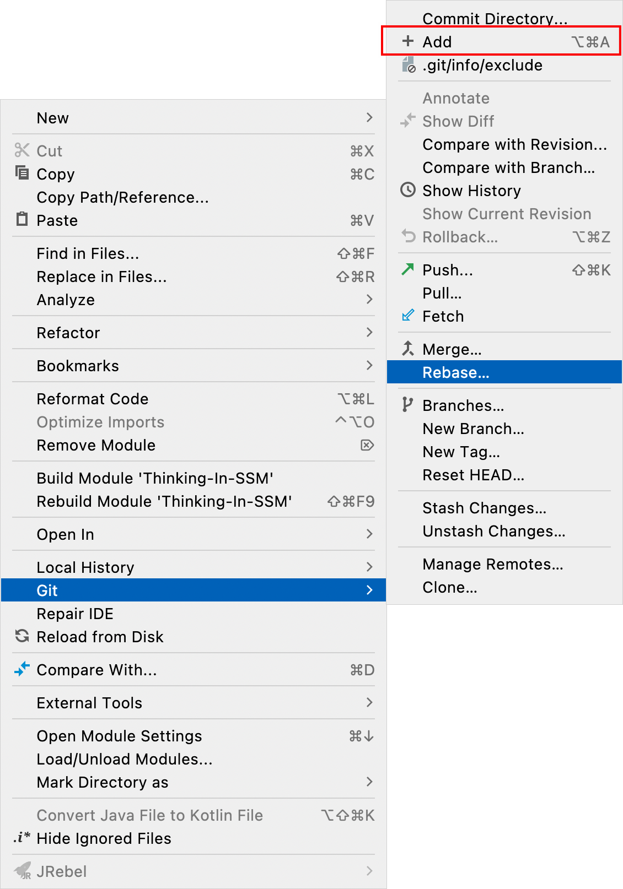

创建文件之后，会提示是否进行 add 操作，选择 Always Add 即可，以后就会自动添加到暂存区。

修改原有的文件，新添加的会显示**绿色**。修改的部分会显示**蓝色**。

点击这一排按钮即可拉去，提交，推送：


## 6.2 .gitignore

.gitignore 文件用于在将文件提交到 git 暂存区时，指定将哪些文件排除。

1. 基本用法：

```
# 忽略.class后缀的所有文件
*.class

# 忽略名称中末尾为ignore的文件夹
*ignore/

# 忽略名称中间包含ignore的文件夹
*ignore*/

# 忽略名.idea文件夹及其子目录
.idea/**
```

2.  .gitignore文件不生效的解决办法：

对于已经进行过 **git add** 操作的目录，如果新添加了.gitignore 文件，则在进行 git commit 时，.gitignore 文件不不会生效的，解决办法如下：

```shell
# 删除在暂存区中的缓存
git rm -r --cached .
# 重新提交
git add .
git commit -m 'update .gitignore'
```

## 6.3 igonre插件

可以使用 IDEA 的 ignore 插件自动生成各式 ignore文件：

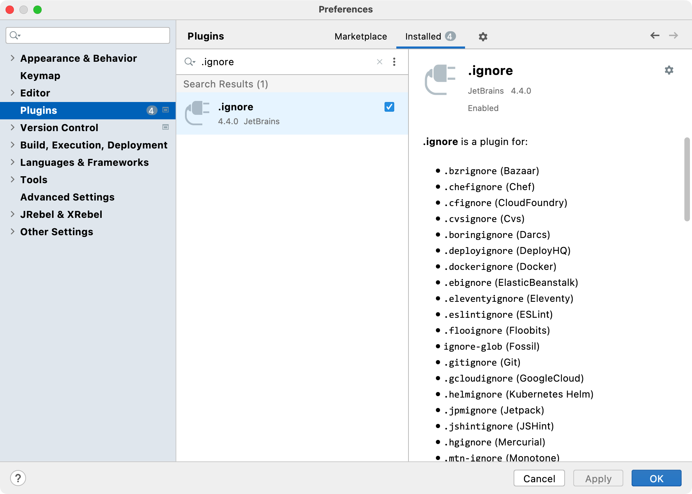

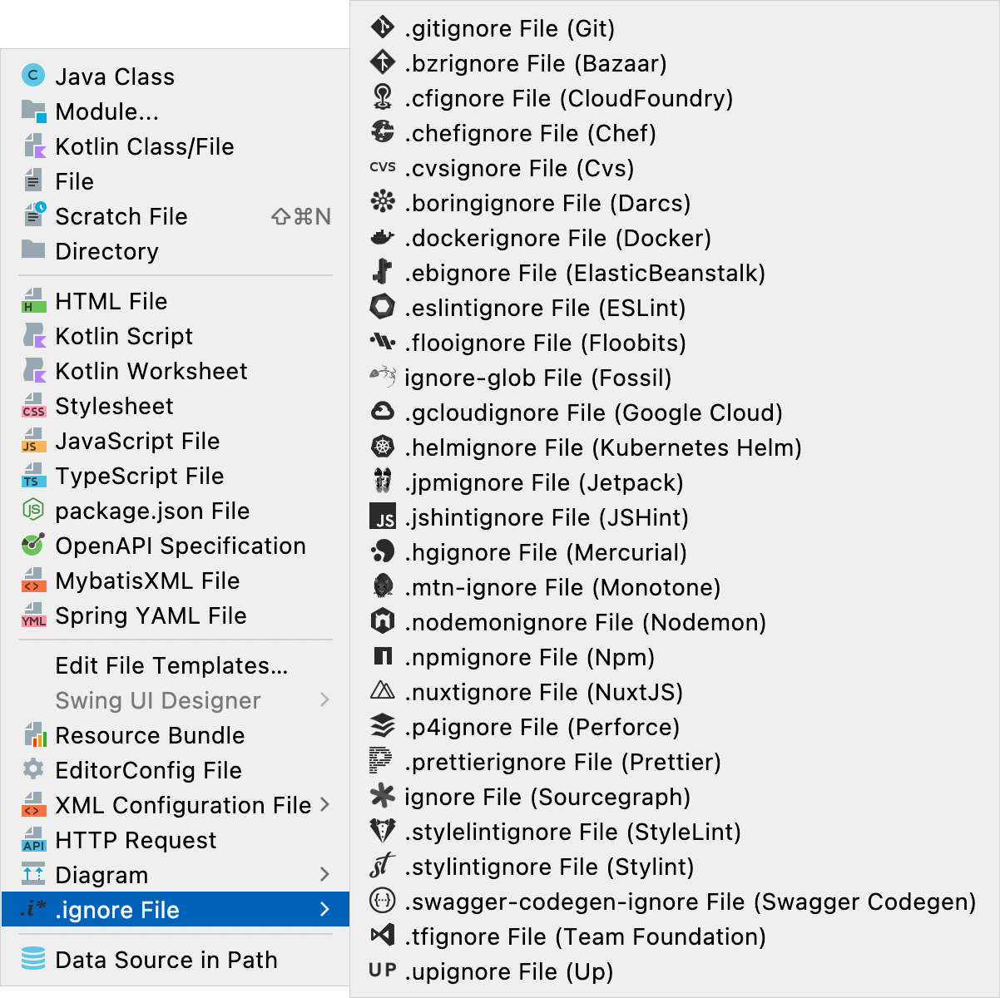

