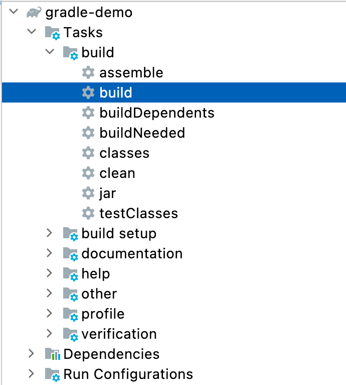

# Gradle

# 一. Gradle优势

- 一款最新的，功能最强大的构建工具，用它逼格更高。
- 使用 Groovy 或 Kotlin 代替 XML，使用程序代替传统的 XML 配置，项目构建更灵活。
- 丰富的第三方插件，让你随心所欲使用。
- 完善 Android，Java 开发技术体系。

# 二. 下载安装

下载位置：https://services.gradle.org/distributions/，下载压缩包即可。

# 三. 配置环境变量

配置 **GRADLE_HOME**：

```shell
export GROOVY_HOME=/Users/element/ProgramSoftWare/groovy-4.0.6
export PATH=${GROOVY_HOME}/bin:${PATH}
```

查看 Gradle 版本：

```shell
gradle -v


------------------------------------------------------------
Gradle 6.9.3
------------------------------------------------------------

Build time:   2022-10-17 07:44:02 UTC
Revision:     a6198e44749b18b37e26b3b3467db17e034bcff4

Kotlin:       1.4.20
Groovy:       2.5.12
Ant:          Apache Ant(TM) version 1.10.9 compiled on September 27 2020
JVM:          17.0.4.1 (Oracle Corporation 17.0.4.1+1-LTS-2)
OS:           Mac OS X 12.4 aarch64

```

# 四. IDEA创建Gradle项目


和 Maven 类似，main 模块下放的是源代码和资源文件夹，test 模块下放的是测试代码和测试资源文件夹，源代码文件夹必须要是蓝色才有效。build.gradle 文件相当于是 Maven 的 pom.xml 文件，做一些项目的配置。



侧边栏的 build 命令可以对当前项目进行打包。如果出现乱码，在 builde.gradle 中加入配置：(更改后重新clean 再 build)。

```groovy
plugins {
    id 'java'
}

group 'org.codeArt'
version '1.0-SNAPSHOT'

repositories {
    mavenLocal()
    mavenCentral()
}

dependencies {
    testImplementation 'org.junit.jupiter:junit-jupiter-api:5.8.1'
    testRuntimeOnly 'org.junit.jupiter:junit-jupiter-engine:5.8.1'
}

test {
    useJUnitPlatform()
}

tasks.withType(JavaCompile) {
    options.encoding = "UTF-8"
}
```


点击这个按钮可以刷新 Gradle 配置。

# 五. 构建脚本

Gradle 构建脚本中最重要的两个概念是 Project 和 Task，任何一个 Gradle 构建都由一个或者多个 project 组成每个 project 包括许多的构建部分，可以是一个 jar 包，也可以是一个 web 应用，也可以是多个 jar 的整合，可以部署应用和搭建环境。可以通过侧边栏的 help 板块下的 projects 命令查看总共有多少个项目。

## 4.1 Project

一个 project 代表一个正在构建的组件(jar/war 文件)，当构建开始时，Gradle 会基于 build.gradle 实例化一个org.gradle.api.Project 对象，并通过 project 变量来隐式调用其成员。

**Project 属性：**

| 名称        | 类型       | 默认值             |
| ----------- | ---------- | ------------------ |
| project     | Project    | Project实例        |
| name        | String     | 项目目录的名称     |
| path        | String     | 项目的绝对路径     |
| description | String     | 项目的描述         |
| projectDir  | File       | 包含生成脚本的目录 |
| buildDir    | File       | projectDir/build   |
| group       | Object     |                    |
| version     | Object     |                    |
| ant         | AntBuilder | AntBuilder实例     |

将 build.gradle 配置封装为一个 Project 对象，对象名字为 project，使用 groovy 语法通过 project 可以隐式调用。

指定仓库位置：默认情况下使用的是中央仓库，此项目如果需要下载 jar 包从中央仓库中下载到本地目录，若要使用本地仓库可以设置 repositories 方法。

```groovy
// 先从本地仓库找，没有再去中央仓库
repositories {
    mavenLocal()
    mavenCentral()
}
```

使用本地仓库还得设置一个 **GRADLE_USER_HOME** 这么一个环境变量，表示本地仓库的位置：

```shell
export GRADLE_USER_HOME=/Users/element/maven-repository
```

配置完成之后，还需要设置 IDEA 的 Gradel user home。Gradle 没有自己的中央仓库，用的就是 maven 的中央仓库。


## 4.2 Task

每个任务在构建执行过程中会被封装成 org.gradle.api.Task 对象，主要包括任务的动作和任务依赖，任务动作定义了一个原子操作，可以定义依赖其他任务、动作的顺序、执行的条件。

任务主要操作**动作**：

- dependsOn：依赖相关操作。
- doFirst：任务执行之前执行的方法。
- doLast(老版本用，现在废弃了)：任务执行之后执行的方法。

定义一个 task，默认分配在 other 分组下，名称是 task 后的内容，然后第二个参数是要执行的内容：

```groovy
task t1, {
    println 'task 1'
    doFirst {
        println 'action before task 1'
    }
    doLast {
        println 'action after task1'
    }
}
```

在右侧会生成一个 t1 选项，双击即可运行：


也可以放在自定义分组下：

```groovy
task t1, {
    group 'iTask'  // 自定义分组iTask
    println 'task 1'
    doFirst {
        println 'action before task 1'
    }
    doLast {
        println 'action after task1'
    }
}
```

**定义任务的 6 种方式：**

1. 繁琐型写法，需要双击右侧边栏齿轮按钮：

```groovy
task(t1, {
    println 'task 1'
    doFirst {
        println 'action before task 1'
    }
    doLast {
        println 'action after task1'
    }
})
```

2. 简写，这种方式可以在 IDEA 中直接点击绿色箭头运行：

```groovy
task t1 {
    println 'task 1'
    doFirst {
        println 'action before task 1'
    }
    doLast {
        println 'action after task1'
    }
}
```

3. create 方法创建：

```groovy
tasks.create('t1') {
    group 'iTask'
    println 'task 1'
}
```

4. register 方法创建：

```groovy
tasks.register('t1') {
    group 'iTask'
    println 'task 1'
}
```

5. 声明在 tasks 中：

```groovy
tasks {
    task t1 {
        group 'iTask'
        println 'task1'
    }
}
```

6. 使用 times 方法一次性创建多个任务：

```groovy
3.times {
    task("task${it}") {
        group 'iTask'
        println "task${it} finished"
    }
}
```

## 4.3 任务依赖

```groovy
task a {
    doFirst {
        println '我是任务a'
    }
}

task b(dependsOn: a) {  // 代表b任务依赖a任务--->依赖方式通过参数传递
    doFirst {
        println '我是任务b'
    }
}

task c {
    dependsOn 'b'  // 依赖方式通过内部设置方式进行依赖
    doFirst {
        println '我是任务c'
    }
}

task d {
    doFirst {
        println '我是任务d'
    }
}

d.dependsOn c   //依赖方式通过外部设置方式进行依赖
```

**任务的执行时机：**

在构建阶段，配置代码是不执行的，在执行阶段，执行动作代码。

- 通过 *tasks.register* 定义的任务，在 build 阶段的配置过程中不执行。
- 通过 *tasks.register* 定义的任务，在任务的执行阶段的配置过程中是执行的。
- 通过 *tasks.register* 定义的任务，配置代码的执行时机是落后于用 task 方式配置的。

**定位任务**是对某个已有的任务进行扩展，例如对 clean 内置任务进行扩展。

```groovy
clean.doLast {
    println '我在clean之后执行这个逻辑'
}

tasks.named('clean').get().doFirst {
    println '我在clean之前执行这个逻辑'
}
```

# 六. 项目构建生命周期

Gradle 的生命周期分三个阶段：初始化阶段、配置阶段、执行阶段。

- **初始化阶段：**

通过 settings.gradlle 判断有哪些项目需要初始化，加载所有需要初始化的项目的 build.gradle 文件并为每个项目创建 project 对象。

- **配置阶段：**

执行各项目下的 build.gradle 脚本，完成 project 的配置，并且构造 Task 任务依赖关系图以便在执行阶段按照依赖关系执行 Task 中的配置代码。

- **执行阶段：**

通过配置阶段的 Task 图，按顺序执行需要执行的任务中的动作代码，就是执行任务中写在 *doFirst* 或 *doLast*中的代码。

# 七. 插件

## 7.1 自定义jar包

1. 首先新建一个 Gradle 工程。
2. 然后配置插件：

```groovy
plugins {
    id 'java-library'   // 为了复用当前项目的API
    id 'maven-publish'  // 用于发布
}
```

3. 然后刷新项目，刷新后任务中多了一个分组：**publishing**。
4. 配置发布分组，在 build.gradle 中配置：

```groovy
publishing {
    // 配置发布动作
    publications {
        maven(MavenPublication) {
            from components.java
        }
    }
    // 配置发布位置到本地maven库中
    repositories {
        mavenLocal()
    }
}
```

5. 执行任务，发布 jar 包到本地仓库中：


6. 去 **.m2** 文件夹下查看生成的 jar 包。

7. 使用 jar 包：

```groovy
compile group: 'org.codeArt', name: 'gradle-demo', version: '1.0-SNAPSHOT'
```

8. 使用内部的类即可。

## 7.2 自定义插件

1. 在构建脚本中直接编写自定义插件：

```groovy
class IPlugin implements Plugin<Project> {
    @Override
    void apply(Project project) {
        project.task("my plugin") {
            doLast {
                println "It's my self-defined Plugin"
            }
        }
    }
}

apply plugin: IPlugin
```

但是上面的方法只能在当前脚本中使用，不可以在整个项目中使用，如果要想在整个项目中的所有构建脚本中都使用的话，需要将任务单独提取出来放入 buildSrc 下。

2. 自行创建 buildSrc 文件，groovy 目录创建好后一定要是蓝色的文件夹，如果是灰色的文件夹，需要自己构建 build.gradle 脚本，然后加入插件：

```groovy
apply plugin: 'groovy'
```

3. 然后定义插件：

```groovy
import org.gradle.api.Plugin
import org.gradle.api.Project

class IPlugin implements Plugin<Project> {
    @Override
    void apply(Project project) {
        project.task("task 1") {
            doLast {
                println "It's my plugin"
            }
        }
    }
}
```

# 八. 版本冲突问题

## 8.1 依赖传递性

假设你的项目依赖于一个库，而这个库又依赖于其他库。你不必自己去找出所有这些依赖，你只需要加上你直接依赖的库，Gradle 会隐式的把这些库间接依赖的库也加入到你的项目中。

由于传递性依赖的特点，两个不同版本的 jar 包会被依赖进来，这样就存在版本冲突的问题。

## 8.2 冲突解决方案

**Maven 解决冲突办法：**

1. 最短路径优先原则。
2. 最先声明原则。

**Gradle 解决冲突办法：**

Gradle 的默认自动解决版本冲突的方案是选用版本最高的。