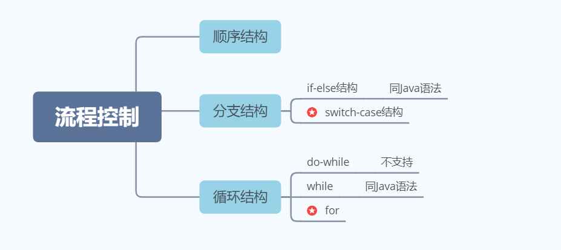

# Groovy(1)

# 一. Gradle和Groovy的引入

## 1.1 为什么要学习Gradle

- 一款最新的，功能最强大的构建工具，用它逼格更高。
- 使用 Groovy 或 Kotlin 代替 XML，使用程序代替传统的 XML 配置，项目构建更灵活。
- 丰富的第三方插件，让你随心所欲使用。
- 完善 Android，Java开发技术体系。

## 1.2 DSL与GPL

DSL 其实是 Domain Specific Language 的缩写，中文翻译为领域特定语言（下简称 DSL），比如说 Matlab，HTML。而与 DSL 相对的就是 GPL，是 General Purpose Language 的简称，即通用编程语言，也就是我们非常熟悉的 Java、Python 以及 C 语言等等。

## 1.3 Groovy的引入

Groovy 是一种 JVM 语言，它可以编译为与 Java 相同的字节码，然后将字节码文件交给 JVM 去执行，并且可以与 Java 类无缝地互操作，Groovy 可以透明地与 Java 库和代码交互，可以使用 Java 所有的库。Groovy 也可以直接将源文件解释执行。它还极大地清理了Java 中许多冗长的代码格式。如果你是 Java 程序员，那么学习 Groovy 简直毫无压力。Groovy 尚未成为主流的开发语言，但是它已经在测试（由于其简化的语法和元编程功能）和构建系统中占据了一席之地。即支持面向对象编程也支持面向过程编程，即可以作为编程语言也可以作为脚本语言。

# 二. 变量

## 2.1 变量的类型

在 Groovy 中，没有基本数据类型，只有对象类型，表面上我们定义基本数据类型，但实际都会帮我们装箱处理：

```groovy
int a = 18
println a.class  // class java.lang.Integer
double b = 19.0
println b.class  // class java.lang.Double
```

## 2.2 变量的定义

1. 强类型定义方式：

```groovy
// 数据类型 名称 = 初始值
int a = 10
```

2. 弱类型定义方式：

```groovy
def c = 10.0
println(c.class)  // class java.math.BigDecimal
```

用 **def** 这种弱类型定义可以随便改变类型。如果不希望别人改变数据类型，用强类型。如果是你自己使用，并且想要随意更改类型，那么就用弱类型。

# 三. 字符串

## 3.1 常用定义方式

1. 单引号定义方式：

```groovy
def str1 = 'hi groo\nvy1' 
println str1 
println str1.class  // class java.lang.String
```

2. 双引号定义方式：

```groovy
def str2 = "hi groovy2" 
println str2 
println str2.class  // class java.lang.String
```

3. 三引号定义方式：

```groovy
def str3 = '''hi groovy3''' 
println str3 
println str3.class  // class java.lang.String
```

**三种定义方式的区别：**

- 用单引号形式定义字符串，那么字符串的格式需要自己去控制，比如加：转义字符。
- 用三引号的形式，我们可以直接在字符串中定义格式，类似 JDK 15 文本块特性：

```groovy
// 如果想要写的形式和展示形式一样，可以在第一个三引号后加入 \
def str3 = '''\
hi 
groovy3
''' 
println str3 
println str3.class  // class java.lang.String
```

- 双引号形式的字符串，可扩展字符串：

```groovy
def a = "Gradle"
def s = "Hello ${a}"
println s  // Hello Gradle

```

- 拼接表达式，可扩展表达式融入到字符串中去：

```groovy
def s = "100 + 100 = ${100 + 100}" 
println s  // 100 + 100 = 200
println s.class  // class org.codehaus.groovy.runtime.GStringImpl
```

GString 和 String 是可以互相转化的。

## 3.2 常用方法

1. 可以直接使用 *java.lang.String* 类的方法：

```groovy
def str1 = "higroovy"
println "字符串的长度为：" + str1.length()  // 8
println "字符串是否为空：" + str1.isEmpty()  // false
println "获取字符串的下标对应的字符为：" + str1.charAt(2)  // g

def str2 = "higroovy"
println "判断两个字符串是否相等：" + str1.equals(str2)  // true
println "字符串从固定位置截取：" + str1.substring(3)  // roovy
println "字符串从区间位置截取：" + str1.substring(2,4)  // gr
println "替换字符串为新字符串：" + str1.replace('o', 'O')  // higrOOvy

def str3 = "a-b-c-d-e-f"
def split = str3.split("-")
println "按照指定的字符串进行分裂为数组的形式:" + split  // [a, b, c, d, e, f]

def str4 = "higroovy"
println "转大写字母：" + str4.toUpperCase()  // HIGROOVY
println "转小写字母：" + str4.toUpperCase().toLowerCase()  // higroovy

def str5 = "  hi groovy  "
println "去除收尾空格：" + str5.trim()  // hi groovy

def str6 = "a"
def str7 = "b"
println "字符串的比较：" + str6.compareTo(str7)  // -1
```

2. 使用 *org.codehaus.groovy.runtime.StringGroovyMethods* 中方法：

```groovy
def str1 = "higroovy"
//   higroovy  
println "以str1字符串为中心在两侧用空格进行填充为指定长度：" + str1.center(12)
// aahigroovyaa
println "以str1字符串为中心在两侧用字符a进行填充为指定长度：" + str1.center(12,'a')
// aahigroovy
println "在str1的左侧进行填充：" + str1.padLeft(10, 'a')

def str2 = "hellogroovy"
def str3 = "groovy"
println "减法操作：去掉重复内容：" + str2.minus(str3)  // hello

def str4 = "higroovy"
println "字符串的逆转/倒叙："+ str4.reverse()  // yvoorgih

println "首字母大写：" + str4.capitalize()  // Higroovy

def str5 = "123"
println "类型的转换：" + str5.toInteger().class  // class java.lang.Integer
```

3. Groovy中新增的操作符：

```groovy
// 操作符-进行比较
def str6 = "a"
def str7 = "b"
println str6 > str7  // false

// 操作符：获取字符串指定下标上的字符：
def str8 = "groovy"
println str8[1]
println str8[2..3]  // oo

// 操作：减法操作：
def str9 = "hellogroovy"
def str10 = "groovy"
println str9 - str10  // hello
```

# 四. 流程控制

流程控制分为：顺序结构、分支结构、循环结构。



## 4.1 switch-case

```groovy
def a = 74
// 在Groovy中a可以是任意类型，case后面可以按照不同类型进行判断：
switch (a) {  // 按照类型比较：a.class
    case 'abc':
        println "这是第1个分支"
        break
    case [4, 7, 9]: // 列表
        println "这是第2个分支"
        break
    case 45..98:  // 范围
        println "这是第3个分支"
        break
    case Integer:
        println "这是第4个分支"
        break
    case BigDecimal:
        println "这是第5个分支"
        break
    default:
        println "这是第6个分支"
        break
}
// 结果：这是第3个分支
```

## 4.2 for循环

1. 普通循环：

```groovy
for (def i = 1; i <= 10; i++) {
    print i + "\t"
}
```

2. 对范围的循环：

```groovy
for (i in 10..30) {
    print i + "\t"
}
```

3. 对列表的循环：

```groovy
for (i in [1, 2, 3, 4, 5]) {
    print i + "\t"
}
```

4. 对 Map 的循环：

```groovy
for (i in [1002: "洛必达", 2004: "欧拉", 9004: "高斯"]) {
    println i.key + "-----" + i.value
}
```


# 五. 闭包

## 5.1 闭包定义

闭包就是一段代码块，用 `{}` 括起来：

```groovy
def c = { println 'hi groovy'}
```

**闭包调用：**

```groovy
c.call()  // 调用call方法
c()		  // 跟普通方法一样调用，类似于函数变量
```

其实闭包就是一种语法糖，它是内置类 Closure 类的子类，所以可以调用 *call* 方法。

**闭包传入参数：**

1. 无参数：

```groovy
// -> 前：闭包参数   -> 后：闭包体
def c = { -> println 'hi groovy'}
c.call()
```

无参数的时候，箭头直接可以省略。

2. 传入一个参数：

```groovy
def c = { String str -> println "hi ${str}"}
c.call('groovy')

// 参数的类型可以省略，但是可读性就不太好，除非能在上游确定参数类型可以这么写
def c = { a ->
    return a.length()
}
println c("hello")
```

3. 传入多个参数：

```groovy
def c = { String str, int num -> println "hi ${str} , hi ${num}"}
def num = 19
c.call('groovy', num)
```

4. 使用默认的参数：

所有闭包都有一个默认参数，不需要你显式声明，用 **it** 接收。如果不想叫 **it**，那么可以手动声明其他名称。

```groovy
def c = { println "hi ${it} "}
c.call('groovy')

def d = { t -> println t }
d.call("Hello")
```

5. 闭包返回值：

闭包一定有返回值，如果不写，就相当于返回 null。

```groovy
def c = { println "hi ${it} "}
def result = c.call('groovy')
println result  // null
```

可以定义返回值：

```groovy
def c = { return "hi ${it} "}
def result = c.call('groovy')
println result  // hi groovy 
```

## 5.2 常见使用场景

### 5.2.1 结合基本数据类型

1. *upTo* 遍历：

```groovy
2.upto(7) { println it }
```

底层源码：

```java
public static void upto(Number self, Number to, @ClosureParams(FirstParam.class) Closure closure) {
    int self1 = self.intValue();
    int to1 = to.intValue();
    if (self1 > to1) {
        throw new GroovyRuntimeException("The argument (" + to + ") to upto() cannot be less than the value (" + self + ") it's called on.");
    } else {
        for(int i = self1; i <= to1; ++i) {
            closure.call(i);
        }
    }
}
```

这里 **self** 对应着第一个调用 *upTo* 方法的数字对象，**to** 对应着第二个参数部分的数字对象，然后 closure 就对应着传递进来的闭包对象。

2. 累加和：

```groovy
// 累加1-100
def result = 0
1.upto(100) { result += it }  // 只有一条语句可以省略return
println result  // 5050
```

3. *downTo* 倒序遍历：

```groovy
5.downto(1) { println it }
```

4. *times* 从 0 开始遍历到指定的数结束：

```groovy
10.times { println it }

// 底层源码
public static void times(Number self, @ClosureParams(value = SimpleType.class,options = {"int"}) Closure closure) {
    int i = 0;
    for(int size = self.intValue(); i < size; ++i) {
        closure.call(i);
        if (closure.getDirective() == 1) {
            break;
        }
    }

}
```

**self** 对应的就是调用方法的数字对象，从 0 开始遍历所以小于 **self** 的数。

闭包写法的解释：如果闭包是方法的最后一个参数，那么可以直接将闭包写在最外面，中间要与其他参数用空格分隔。

```groovy
2.upto(7) { println it }   // 常用 
2.upto(7, { println it })  // 不常用
```

### 5.2.2 结合字符串

1. 遍历字符串：

```groovy
def s = "Hello World1000"
println s.each { println it }  // each的返回值就是字符串s本身
```

2. 找到符合条件的第一个值：

```groovy
def s = "Hello World1000"
println s.find { it.isNumber() }  // 1
```

3. 找到符合条件的所有值：

```groovy
println s.findAll { it.isNumber() }  // [1, 0, 0, 0]
```

4. 判断任意一位是否满足条件：

```groovy
println s.any { it.isNumber() }  // true
```

5. 判断每一位是否满足条件：

```groovy
println s.every { it.isNumber() }  // false
```

6. 收集结果：

```groovy
println s.collect { it.toUpperCase() }  // [H, E, L, L, O,  , W, O, R, L, D, 1, 0, 0, 0]
```

## 5.3 闭包中的变量

1. this：

this 代表定义该闭包的类的实例对象（实例闭包）或者类本身（静态闭包）。

2. owner：

可以和 this 用法一样，还可以用作：当闭包中嵌套闭包的时候，这时候 owner 就指向定义它的闭包对象。

3. delegate：

它的含义大多数情况下是跟 owner 的含义一样，除非它被显示地修改。

在 Groovy 脚本中定义闭包，那么 this，owner，delegate 指代的都是**当前所在的脚本的类的对象**（当前脚本编译后对应的就是一个脚本类型的类）。

```groovy
def c1 = {
    println "c1-this:" + this
    println "c1-owner:" + owner
    println "c1-delegate:" + delegate
}
c1.call()
// c1-this:org.codeArt.script@6ad3381f
// c1-owner:org.codeArt.script@6ad3381f
// c1-delegate:org.codeArt.script@6ad3381f
```

### 5.3.1 定义内部类

如果定义内部类，那么无论是闭包中还是方法中，this，owner，delegate 指代的都是所在类的对象，也就是本例中 Person 的对象：

```groovy
class Person {
    def c2 = {
        println "c2-this:" + this
        println "c2-owner:" + owner
        println "c2-delegate:" + delegate
    }

    def test() {
        def c3 = {
            println "c3-this:" + this
            println "c3-owner:" + owner
            println "c3-delegate:" + delegate
        }
        c3.call()
    }
}
Person p = new Person()
p.c2.call()
p.test()
// c2-this:org.codeArt.Person@5cde6747
// c2-owner:org.codeArt.Person@5cde6747
// c2-delegate:org.codeArt.Person@5cde6747
// c3-this:org.codeArt.Person@5cde6747
// c3-owner:org.codeArt.Person@5cde6747
// c3-delegate:org.codeArt.Person@5cde6747
```

如果定义的内容是静态的，那么 this，owner，delegate 指代的就是所在的类，本例中也就是 Person 类：

```groovy
class Person{
    def static c2 = {
        println "c2-this:" + this
        println "c2-owner:" + owner
        println "c2-delegate:" + delegate
    }

    def static test(){
        def c3 = {
            println "c3-this:" + this
            println "c3-owner:" + owner
            println "c3-delegate:" + delegate
        }
        c3.call()
    }
}
Person.c2.call()
Person.test()
// c2-this:class org.codeArt.Person
// c2-owner:class org.codeArt.Person
// c2-delegate:class org.codeArt.Person
// c3-this:class org.codeArt.Person
// c3-owner:class org.codeArt.Person
// c3-delegate:class org.codeArt.Person
```

### 5.3.2 闭包中嵌套闭包

this 指代的依然是所在的类，但是 owner，delegate 指代的就是嵌套闭包的闭包。

```groovy
def c4 = {
    def c5 = {
        println "c5-this:" + this
        println "c5-owner:" + owner
        println "c5-delegate:" + delegate
    }
    c5.call()
}
c4.call()
// c5-this:org.codeArt.script@62727399
// c5-owner:org.codeArt.script$_run_closure1@76012793
// c5-delegate:org.codeArt.script$_run_closure1@76012793
```

**总结：**无论什么情况下，this 指代的都是所在类/类的对象，但是如果遇到闭包嵌套闭包，owner，delegate指代的就是嵌套闭包的闭包。owner，delegate 不同的情况：它的含义大多数情况下是跟 owner 的含义一样，除非它被显示的修改。

```groovy
Person p = new Person()
c5.delegate = p
```

## 5.4 闭包委托策略

```groovy
class A {
    String name
    def ac = {
        "name = ${name}"
    }
    String toString() {
        ac.call()
    }
}
class B {
    String name
}
def a = new A(name: "洛必达")
def b = new B(name: "欧拉")
println a.toString()  // name = 洛必达 
```

`${name}` 取值是从 delegate 中取值，所以 delegate 默认情况下指代的是当前 A 的对象。

想要得到菲菲的结果，解决修改 delegate：

```groovy
a.ac.delegate = b
println a.toString()  // name = 洛必达
```

但是发现修改 delegate 不好用，因为默认情况下 delegate 委托机制是 owner first，所以我们需要修改委托策略。

```groovy
a.ac.delegate = b 
a.ac.resolveStrategy = Closure.DELEGATE_FIRST
println a.toString()  // name = 欧拉
```

总结：`${name}` 默认从 delegate 取值，delegate 默认和 owner 的值一样，委托机制也是 **OWNER_FIRST** 优先，所以你光改变 delegate 的值没用，**需要修改委托策略为：DELEGATE_FIRST**。

# 六. 列表

## 6.1 列表定义

列表和数组很类似定义方式在 Groovy 中有两种，一种是用 Groovy 的语法，还有一种是使用 Java 原生的语法：

```groovy
// 列表
def list = new ArrayList()
def list2 = [1, 2, 3, 4, 5, 6, 7]
println list2.class  // class java.util.ArrayList
println list2.size()  // 7

// 数组
def arr = [1, 2, 3, 4] as int[]
int[] arr2 = [1, 2, 3, 4]
println arr.class  // class [I
println arr2.class  // class [I
```

## 6.2 列表使用

**添加元素：**

```groovy
// 添加操作
list.add(7)
println list  // [1, 2, 3, 4, 5, 6, 7]
list.leftShift(8)
println list  // [1, 2, 3, 4, 5, 6, 7, 8]
list << 9
println list  // [1, 2, 3, 4, 5, 6, 7, 8, 9]
list = list + 10
println list  // [1, 2, 3, 4, 5, 6, 7, 8, 9, 10]
```

**删除元素：**

- 按照指定索引删除：

```groovy
def list2 = [1, 2, 3, 4, 5, 6]
list2.remove(3)
println list2.toListString()  // [1, 2, 3, 5, 6]
```

- 按照指定元素删除：

```groovy
list2.remove((Object) 5)
println list2.toListString()  // [1, 2, 3, 6]
list2.removeElement(6)
println list2.toListString()  // [1, 2, 3]
```

- 按照指定条件删除元素：

```groovy
def list3 = [1, 2, 3, 4, 5, 6]
list3.removeAll { it % 2 == 0 }
println list3.toListString()  // [1, 3, 5]
```

- 使用操作符删除：

```groovy
def list4 = [1, 2, 3, 4, 5, 6]
def newList4 = list4 - [4, 5, 6]
println newList4  // [1, 2, 3]
```

**排序操作：**

- 默认按照升序排序：

```groovy
def list = [-3, -1, 4, 0, 5, 2, -6]
list.sort()
println list  // [-6, -3, -1, 0, 2, 4, 5]
```

- 按照指定条件排序：

```groovy
// 按照绝对值的大小升序排序
list.sort { num1, num2 -> Math.abs(num1) - Math.abs(num2) }
println list  // [0, -1, 2, -3, 4, 5, -6]

// 按照字符串长度降序排序
list = ['a', 'abcdef', 'abc', 'ab']
list.sort {s1, s2 -> s2.size() - s1.size() }
println list  // [abcdef, abc, ab, a]
```

**查找操作：**

- 根据条件查找元素：

```groovy
def list = [-3, -1, 4, 0, 5, 2, -6]
// 查找第一个
println list.find { it % 2 == 0 }  // 4
// 查找所有返回列表
println list.findAll { it % 2 == 0 }  // [4, 0, 2, -6]
```

- 根据条件查找是否存在元素，返回 boolean：

```groovy
// 判断是否存在
println list.any { it % 2 == 0 }  // true
// 判断是否每个元素都满足条件
println list.every { it % 2 == 0 } // false
```

- 获取最值：

```groovy
println list.min()  // -6
println list.max()  // 5
```

- 统计总数：

```groovy
// 统计正数
println list.count { it >= 0 }  // 4
```

# 七. 映射

## 7.1 映射定义

```groovy
// 定义Java中的HashMap
def map = new HashMap()

// 在Groovy中定义，默认是LinkedHashMap类型
def map = ['张三': 1001, '李四': 2003, '王五': 9006]
println map.getClass()  // class java.util.LinkedHashMap
```

- 可以通过 key 添加 value 或者修改 value，value 甚至可以是映射类型：

```groovy
map['洛必达'] = 3000
map.'张三' = 100
map.newMap = ['x': 1, 'y': 2]
```

- 上述代码中，key 部分是单引号的不可变字符串，可以单引号省略不写：

```groovy
def map = [张三: 1001, 李四: 2003, 王五: 9006]
```

- 可以使用 **as** 关键字改变默认映射类型：

```groovy
// class java.util.Hashtable
def map = [张三: 1001, 李四: 2003, 王五: 9006] as Hashtable
// 或者直接使用类型声明
Hashtable map = [张三: 1001, 李四: 2003, 王五: 9006]
```

## 7.2 映射使用

**映射的遍历：**

```groovy
def map = [
        '张三'    : 1001,
        '李四'    : 2003,
        '王五'    : 9006,
        '朱六'    : 9005,
        'newMap': ['x': 1, 'y': 2]
]
// 使用each方法遍历
map.each { println it.key + "----" + it.value }  // it是Entry<String, Serializable>
map.each { key, value -> println key + "----" + value }
// 使用带索引的遍历
map.eachWithIndex { Map.Entry<String, Serializable> entry, int index ->
    println entry.key + "----" + entry.value + "-----" + index
}
map.eachWithIndex { key, value, index ->
    println key + "----" + value + "-----" + index
}
```

**映射的查找：**

```groovy
def map = [
        '张三': ['score': 68, 'sex': '女'],
        '李四': ['score': 32, 'sex': '男'],
        '王五': ['score': 71, 'sex': '女'],
        '朱六': ['score': 74, 'sex': '男']
]
```

- 找到映射中第一个 score 大于 70 的键值对信息：

```groovy
println map.find { it.value.score > 70 }
```

- 找到映射中所有 score 大于 70 的键值对信息：

```groovy
println map.findAll { it.value.score > 70 }
```

- 统计数据：

```groovy
// 成绩大于60，性别女
println map.count { it.value.score > 60 && it.value.sex == '女' }
```

- 查找并收集：

```groovy
println map.findAll { it.value.score > 70 }
        .collect { it.key }  // 最后使用它们的key收集起来
```

- 分组：

```groovy
println map.groupBy { it.value.score >= 60 ? "及格" : "不及格" }  // 分成两组
```

**映射的排序：**

```groovy
def map = [
        '张三': ['score': 68, 'sex': '女'],
        '李四': ['score': 32, 'sex': '男'],
        '王五': ['score': 71, 'sex': '女'],
        '朱六': ['score': 74, 'sex': '男']
]

//排序：
//按照指定的条件进行排序：按照学生的成绩排列：
def newMap = map.sort {
    stu1, stu2 ->
        def score1 = stu1.value.score
        def score2 = stu2.value.score
        return score1 == score2 ? 0 : score1 < score2 ? 1 : -1
}

println newMap
```

# 八. 范围

## 8.1 定义一个范围

```groovy
// 定义范围2,3,4,5
def r = 2..5
println r.size()  // 4
```

可以定义不包含端点的范围：

```groovy
def r2 = 3..<8  // 3,4,5,6,7
println r2.size()  // 5
```

## 8.2 范围的操作

```groovy
def r = 2..5
// 通过索引获取元素
println r[1]  // 3
// 判断是否包含某个具体的数值
println r.contains(4)  // true
// 范围开始的数字
println r2.from  // 2
// 范围结束的数字
println r2.to  // 5
```

**遍历范围：**

```groovy
r.each { println it }
// 或者使用增强for循环
for (el in r2) {
    println el
}
```