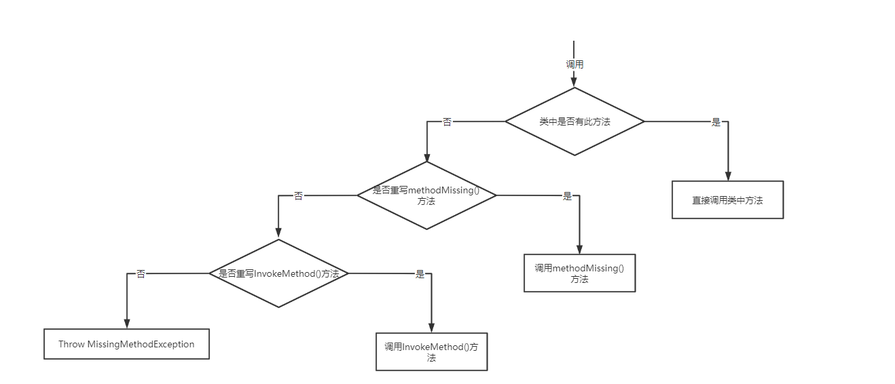

# Groovy(2)

# 九. 面向对象

## 9.1 类和对象的定义

**类的定义：**

类的定义使用 **class** 关键字声明类，所有的属性和方法默认都是使用 **public** 修饰。

```groovy
class Student {
    String name
    Integer age

    Student(name, age) {
        this.name = name
        this.age = age
    }
}
```

**对象的创建：**

和 Java 一样，每个类有一个默认的无参构造方法，若声明其他了有参构造方法，那么必须显式声明无参构造方法，否则调用会报错。即使没有显示声明构造方法，也可以在创建对象时对属性进行初始化赋值。

```groovy
def s1 = new Student()  // Error,Missing non-variable Constructor
def s2 = new Student(name: "洛必达", age: 19)  // 仅在没有声明任何构造方法时可用
def s3 = new Student(name: "洛必达")
```

若显示声明了构造方法，那么就可以使用如下方式使用构造方法：

```groovy
def s2 = new Student("洛必达", 19)
def s3 = ["洛必达", 17] as Student
Student s4 = ["洛必达", 15]
```

**属性的取值：**

无论是用 `.` 的方式直接取值，还是用 **get/set** 的方式取值，实际底层调用的都是 **get/set** 方法。

```groovy
s2.name = "欧拉"
s2.setAge(100)
println "姓名：${s2.name}，年龄：${s2.age}"
println "姓名：${s2.getName()}，年龄：${s2.getAge()}"
```

## 9.2 方法的定义和调用

**方法的定义：**

在 **def** 关键字就相当于是 Object 类型，若只有一条语句，那么可以省略 **return** 关键字。

```groovy
def m1() {
    'returned m1'
}

def m2(var1, var2) {
    "returned ${var1}, ${var2}"
}

static def m3() {
    'returned m3'
}
println m1()
// println m2 1, 2
println m2(1, 2)
println m3()
```

方法调用时，括号可以不写，但是参数和方法名称之间必须要有空格。假如参数是闭包，闭包直接可以写在最外面，**仅当闭包是最后一个参数才行**，参数可以写在括号里面，这种写法比较推荐。

```groovy
def m1(int a, Closure<Integer> c) {
    c.call(a)
}
m1 10, { println it }
m1(10) { println it }
```

## 9.3 接口

**接口的声明：**

```groovy
interface Movable {
    void run();
    def eat();
    default jump() {
        println 'jump'
    }
    static void drink() {
        println 'drink'
    }
}
```

在 Groovy 中，接口里面不可以声明**非public**方法，就是说所有方法都要是公开的，**default** 方法需要实现方法体内容。

**实现接口：**

groovy 所有东西默认都是 public 修饰，不用显示声明权限修饰符。

```groovy
class Student implements Movable {
    @Override
    void run() {

    }

    @Override
    def eat() {
        return null
    }
}
```

## 9.4 Trait

Trait 在开发中用得较少，做一点了解就行。

**定义 Trait：**

```groovy
trait Swimming {
    // 抽象方法：abstract修饰符必须加上
    abstract void drink()
    // 实现方法：
    def swim(){
        println '可以游泳'
    }
}
```

在 Trait 中定义抽象方法和非抽象方法，定义以后就可以让类来使用(使用和接口很像，用 **implements** 来实现 Trait)：

```groovy
class Swimmer implements Swimming {
    @Override
    void drink() {
        println '喝水'
    }
}
```

调用方式如下：

```groovy
def swimmer = new Swimmer()
swimmer.drink()
swimmer.swim()
```

一个类可以实现多个 Trait (解决了多继承问题)：

```groovy
trait Flying {
    def fly() {
        println '可以飞行'
    }
}

class Swimmer implements Swimming, Flying {
    @Override
    void drink() {
        println '喝水'
    }
}
```

Trait 就像是抽象类和接口的结合，类实现用 implements 关键字来实现，可以实现多个 Trait。

## 9.5 元编程

### 9.5.1 方法调用和拦截

使用运行时元编程，我们可以在运行时截取类和接口的方法。

**定义一个类：**

```groovy
class Person {
    String name
    Integer age

    def eat() {
        return '吃饭'
    }
}
```

调用声明的方法：

```groovy
def p = new Person()
println p.eat()
println p.play()
// 报错：
// Caught: groovy.lang.MissingMethodException: No signature of method: 
// org.codeArt.Person.play() is applicable for argument types: () values: []
```

调用已有的 *eat* 方法，直接调用没有问题，但是调用没有的方法 *play* 会直接出错。但是在 groovy 中可以用重写方法的形式来替换不存在的方法：

```groovy
class Person {
    // ...
    @Override
    Object invokeMethod(String name, Object args) {
        println '调用了invokeMethod方法'
        return "当前这个方法是：${name}，当前这个方法的参数是：${args}"
    }
}
```

如果重写了 *methodMissing* 方法，会调用 *methodMissing* 方法：

```groovy
def methodMissing(String name, Object args) {
    println '调用了methodMissing方法'
    return "当前这个方法是：${name}，当前这个方法的参数是：${args}"
}
```

### 9.5.2 metaClass

使用运行时元编程，我们可以在运行时注入，合成类和接口的方法。

动态添加属性：

```groovy
Person.metaClass.sex = "女"
def p = new Person(name: "丽丽", age: 19)
p.sex = "男"
println p.sex  // 男
```

动态添加方法：

```groovy
Person.metaClass.setNameUpperCase = { -> name.toUpperCase() }
def p2 = new Person(name: "abcdef", age: 19)
println p2.setNameUpperCase()  // ABCDEF
```

动态添加静态方法：

```groovy
Person.metaClass.static.setNameLowerCase = { String name -> name.toLowerCase() }
println Person.setNameLowerCase("ABCDEF")  // abcdef
```

# 十. Groovy操作JSON

## 10.1 内置类操作

使用内置的 JsonOutPut 类的 *toJson* 方法可以将对象转为 JSON 字符串，但是不支持中文，需要中文那就使用第三方 JSON 工具类库。

```groovy
def p = new Person(name: "frank", age: 19)
println JsonOutput.toJson(p)

def list = [
        new Person(name: "frank", age: 19),
        new Person(name: "mark", age: 21), 
        new Person(name: "jesus", age: 17)
]
println JsonOutput.toJson(list)
```

使用 JsonOutput 类的 *prettyPrint* 方法可以格式化 JSON 字符串：

```groovy
def jsonStr = JsonOutput.toJson(list)
println JsonOutput.prettyPrint(jsonStr)
```

使用 JsonSlurper 类的 *parseText* 方法可以将 JSON 字符串转为对象：

```groovy
def str = '{"age": 19, "name": "lucy"}'
def js = new JsonSlurper()
def p2 = (Person) (js.parseText(str))
println p2

def list2 = js.parseText('[{"age": 19, "name": "lucy"},{"age": 21,"name": "lilei"},{"age":17, "name": "lulu"}]')
println list2
```

## 10.2 第三方类

可以使用 Google 的 Gson 类库做 JSON 字符串的转化：

```groovy
def p = new Person(name: "lili", age: 19)
def gson = new Gson()
println gson.toJson(p)  // {"name":"lili","age":19}

def p2 = gson.fromJson('{"name":"lili","age":19}', Person.class)
println p2
```

当然，选择 JackSon 或者 FastJson 也未尝不可。

# 十一. Groovy操作XML

## 11.1 解析XML

可以使用内置的 XmlSlurper 类的 *parseText* 方法解析 XML 字符串，返回类型是 GPathResult：

```groovy
final String xml = '''\
<students>
    <student id="1">
        <name>张三</name>
        <age>18</age>
        <sex>男</sex>
        <score>98</score>
    </student>
    <student id="2">
        <name>李四</name>
        <age>21</age>
        <sex>女</sex>
        <score>93</score>
    </student>
    <student id="3">
        <name>王五</name>
        <age>19</age>
        <sex>女</sex>
        <score>89</score>
    </student>
</students>
'''

def xs = new XmlSlurper()
def students = xs.parseText(xml)
// 获取节点的值：
println students.student[0].name.text()

// 获取属性的值：
println students.student[1].@id
```

**遍历 XML：**

```groovy
def list = students.student.collect { it -> it.name.text() + "---" + it.age.text() }
println list
```

## 11.2 生成XML

使用 MarkupBuilder 类可以通过对象生成 XML 字符串，`()` 中传入节点的属性，`{}` 传入下级的节点，`()` 中最后一个参数表示该节点的内容：

```groovy
def s = new StringWriter()
def mb = new MarkupBuilder(s)
mb.Students() {
    //第1个student节点：()中传入student节点的属性，{}中传入student下的节点
    Student(id: '1') {
        name(a: 'a', '张三')
        age('18')
        sex('男')
        score('98')
    }

    //第2个student节点：()中传入student节点的属性，{}中传入student下的节点
    Student(id: '2') {
        name('李四')
        age() {
            va('21')
        }
        sex('女')
        score('93')
    }
}
println s
/*
    <Students>
      <Student id='1'>
        <name a='a'>张三</name>
        <age>18</age>
        <sex>男</sex>
        <score>98</score>
      </Student>
      <Student id='2'>
        <name>李四</name>
        <age>
          <va>21</va>
        </age>
        <sex>女</sex>
        <score>93</score>
      </Student>
    </Students>
*/
```

# 十二. Groovy操作文件

## 12.1 操作普通文件

使用 File 类来创建对象，File 类是 Java 的 File 类，参数传入的是文件的路径，使用 *eachLine* 方法可以对每行内容进行操作：

```groovy
def file = new File("/Users/element/Students.xml")
file.eachLine { println it }  // it就是每行内行
```

使用 *getText* 方法获取文件中所有内容：

```groovy
println file.getText()
```

可以使用 *readLines* 方法返回一个列表：

```groovy
def list = file.readLines()
```

还可以使用 *withReader* 方法传入一个闭包读取部分内容：

```groovy
println file.withReader {
    char[] buffer = new char[100]
    it.read(buffer)  // 读取100个字符的内容
    return buffer
}
```

可以定义一个 *copy* 方法实现文件的拷贝：

```groovy
static def copy(String srcPath, String descPath) {
    // 确定目标文件：
    def destFile = new File(descPath)
    if (!destFile.exists()) {
        destFile.createNewFile()
    }
    // 复制：
    new File(srcPath).withReader {
        def lines = it.readLines()  // it -> BufferedReader
        destFile.withWriter {
            lines.each { line ->
                it.append(line + "\r\n")  // it -> BufferedWriter
            }
        }
    }
    return true
}
```

## 12.2 将对象写入文件

封装一个 static 方法保存对象到文件：

```groovy
static def saveObject(Object obj, String path) {
    def file = new File(path)
    if (!file.exists()) {
        file.createNewFile()
    }
    file.withObjectOutputStream {
        it.writeObject(obj)
    }
    return true
}

def s = new Student(name: "洛必达", age: 18)
saveObject(s, "/Users/admin/student.data")
```

## 12.3 从文件中读取对象

可以定义一个 *readObject* 方法，从二进制文件中读取并转换成对象：

```groovy
static def readObject(String path) {
    def obj = null
    def file = new File(path)
    if (file == null || !file.exists()) {
        return null
    }
    file.withObjectInputStream {
        obj = it.readObject() // 读取后给obj赋值
    }
    return obj
}
def s2 = (Student) readObject("/Users/admin/student.data")
println s2.name + "---" + s2.age
```