# Maven快速入门

本文档主要介绍了Maven的基本使用,带小白快速入门项目构建工具.


# 一. Maven介绍

## 1.1  什么是 Maven

Maven 的正确发音是[ˈmeeɪvən]，而不是“马瘟”以及其他什么瘟。Maven 在美国是一个口语化的词语，代表专家、内行的意思。一个对 Maven 比较正式的定义是这么说的：Maven 是一个项目管理工具，它包含了一个 项目对象模型(**POM：Project Object Model**)，一组标准集合，一个项目生命周期(ProjectLifecycle)，一个依赖管理系统(Dependency Management System)，和用来运行定义在生命周期阶段(phase)中插件(plugin)目标(goal)的逻辑。                                                                                 


## 1.2 Maven能解决什么问题

可以用更通俗的方式来说明。我们知道，项目开发不仅仅是写写代码而已，期间会伴随着各种 必不可少的事情要做，下面列举几个感受一下：

1. 我们需要引用各种 jar 包，尤其是比较大的工程，引用的 jar 包往往有几十个乃至上百个， 每用到一种 jar 包，都需要手动引入工程目录，而且经常遇到各种让人抓狂的 jar 包冲突，版本冲突。

2. 我们辛辛苦苦写好了 Java 文件，可是只懂 0 和 1 的白痴电脑却完全读不懂，需要将它编译成二进制字节码。好歹现在这项工作可以由各种集成开发工具帮我们完成，Eclipse、IDEA 等都可以将代码即时编译。当然，如果你嫌生命漫长，何不铺张，也可以用记事本来敲代码，然后用 javac 命令一个个地去编译，逗电脑玩。

3. 世界上没有不存在 bug 的代码，计算机喜欢 bug 就和人们总是喜欢美女帅哥一样。为了追求美为了减少 bug，因此写完了代码，我们还要写一些单元测试，然后一个个的运行来检验代码质量。

4. 再优雅的代码也是要出来卖的。我们后面还需要把代码与各种配置文件、资源整合到一起，定型 打包，如果是web 项目，还需要将之发布到服务器，供人蹂躏。试想，如果现在有一种工具，可以把你从上面的繁琐工作中解放出来，能帮你构建工程，管理 jar 包，编译代码，还能帮你自动运行单元测试，打包，生成报表，甚至能帮你部署项目，生成 Web 站点，你会心动吗？Maven 就可以解决上面所提到的这些问题。


## 1.3 Maven的优势

前面我们通过 Web 阶段项目，要能够将项目运行起来，就必须将该项目所依赖的一些 jar 包添加到 工程中，否则项目就不能运行。试想如果具有相同架构的项目有十个，那么我们就需要将这一份 jar 包复制到十个不同的工程中。我们一起来看一个CRM项目的工程大小。 使用传统 Web 项目构建的 CRM 项目如下：

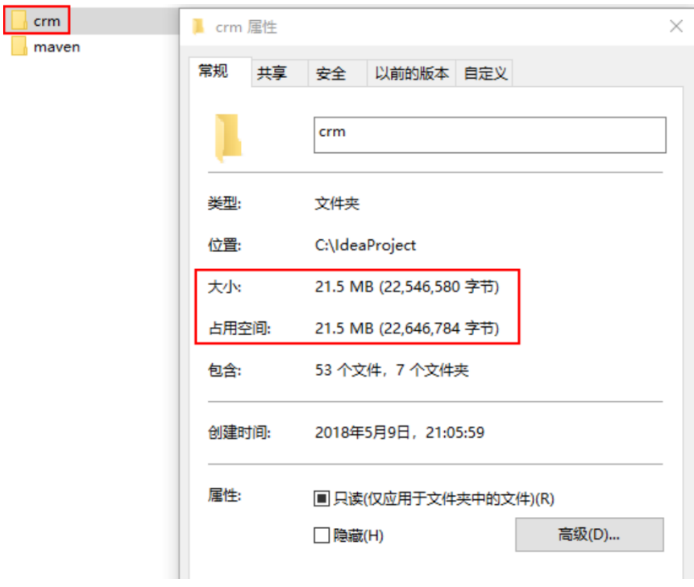

原因主要是因为上面的 WEB 程序要运行，我们必须将项目运行所需的 Jar 包复制到工程目录中，从 而导致了工程很大。 同样的项目，如果我们使用 Maven 工程来构建，会发现总体上工程的大小会少很多。如下图: 

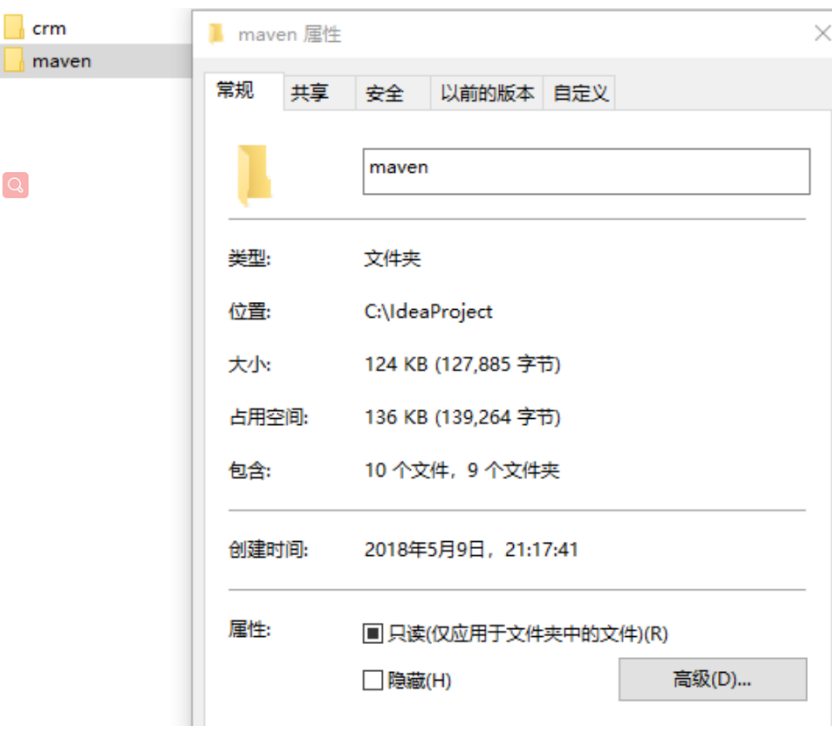

小结：可以初步推断它里面一定没有 jar 包，继续思考，没有 jar 包的项目怎么可能运行呢？

## 1.5 Maven 的两个典型作用

### 1.5.1  Maven 的依赖管理

Maven 的一个核心特性就是依赖管理。当我们涉及到多模块的项目（包含成百个模块或者子项目），管理依赖就变成 一项困难的任务。Maven 展示出了它对处理这种情形的高度控制。 传统的 WEB 项目中，我们必须将工程所依赖的 jar 包复制到工程中，导致了工程的变得很大。那么 maven 工程是如何使得工程变得很少呢？ 分析如下：

通过分析发现：maven 工程中不直接将 jar 包导入到工程中，而是通过在 pom.xml 文件中添加所需 jar 包的坐标，这样就很好的避免了 jar 直接引入进来，在需要用到 jar 包的时候，只要查找 pom.xml 文 件，再通过 pom.xml 文件中的坐标，到一个专门用于”存放 jar 包的仓库”(maven 仓库)中根据坐标从 而找到这些 jar 包，再把这些 jar 包拿去运行。 那么问题来了 第一：”存放 jar 包的仓库”长什么样？ 第二：通过读取 pom.xml 文件中的坐标，再到仓库中找到 jar 包，会不会很慢？从而导致这种方式 不可行！ 第一个问题：存放 jar 包的仓库长什么样，这一点我们后期会分析仓库的分类，也会带大家去看我们 的本地的仓库长什么样。 第二个问题：通过 pom.xml 文件配置要引入的 jar 包的坐标，再读取坐标并到仓库中加载 jar 包，这 样我们就可以直接使用 jar 包了，为了解决这个过程中速度慢的问题，maven 中也有索引的概念，通 过建立索引，可以大大提高加载 jar 包的速度，使得我们认为 jar 包基本跟放在本地的工程文件中再 读取出来的速度是一样的。这个过程就好比我们查阅字典时，为了能够加快查找到内容，书前面的 目录就好比是索引，有了这个目录我们就可以方便找到内容了，一样的在 maven 仓库中有了索引我 们就可以认为可以快速找到 jar 包。


### 1.5.2 项目的一键构建

我们的项目，往往都要经历编译、测试、运行、打包、安装 ，部署等一系列过程。 什么是构建？ 指的是项目从编译、测试、运行、打包、安装 ，部署整个过程都交给 maven 进行管理，这个 过程称为构建。 一键构建指的是整个构建过程，使用 maven 一个命令可以轻松完成整个工作。 Maven 规范化构建流程如下：

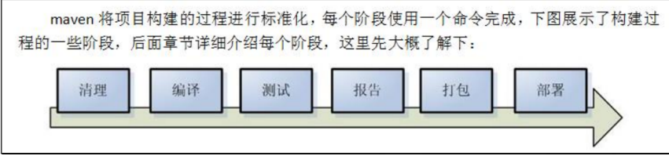


# 二. Maven实战

## 2.1 Maven安装

先去百度搜索Maven,然后去Apache Maven官网下载Maven.下载好之后,解压到固定文件夹,配置好Maven的bin目录的环境变量(使用Maven前一定要配置好JDK的环境变量,Maven依赖JDK),最后在命令行输入

```shell
mvn -v
```

安装成功,如图所示:

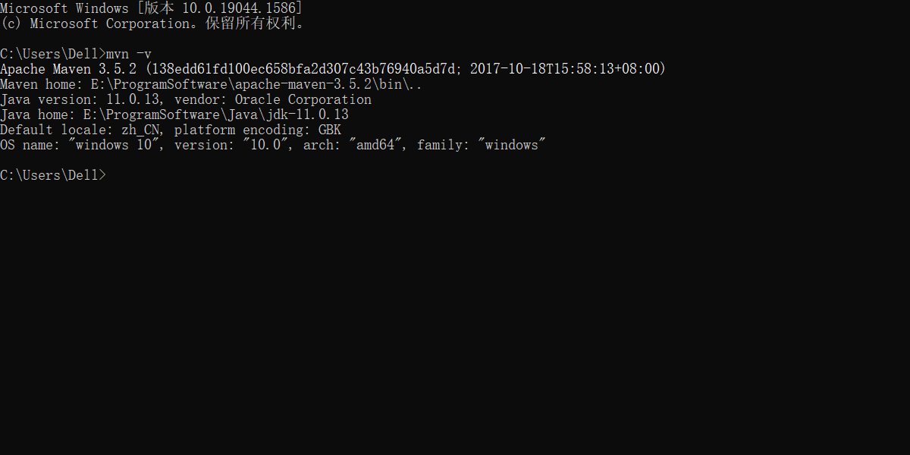


## 2.2 设置Maven仓库

### 2.2.1 Maven的仓库分类

maven 的工作需要从仓库下载一些 jar 包，如下图所示，本地的项目 A、项目 B 等都会通过 maven 软件从远程仓库（可以理解为互联网上的仓库）下载 jar 包并存在本地仓库，本地仓库 就是本地文 件夹，当第二次需要此 jar 包时则不再从远程仓库下载，因为本地仓库已经存在了，可以将本地仓库 理解为缓存，有了本地仓库就不用每次从远程仓库下载了。

- **本地仓库** ：用来存储从远程仓库或中央仓库下载的插件和 jar 包，项目使用一些插件或 jar 包， 优先从本地仓
  库查找 默认本地仓库位置在 ${user.dir}/.m2/repository，${user.dir}表示windows 用户目录。
- **远程仓库**：如果本地需要插件或者 jar 包，本地仓库没有，默认去远程仓库下载。 远程仓库可以在互联网内也
  可以在局域网内。
- **中央仓库** ：在 maven 软件中内置一个远程仓库地址 http://repo1.maven.org/maven2 ，它是中 央仓库，服务
  于整个互联网，它是由 Maven 团队自己维护，里面存储了非常全的 jar 包，它包 含了世界上大部分流行的开源
  项目构件。

### 2.2.2 Maven的本地仓库配置

在电脑合适的位置创建名为LocalRepository的文件夹,我这边是创建到E盘下的,然后Maven安装目录conf文件夹下的**settings.xml**文件,找到如下位置的代码:

```xml
<settings xmlns="http://maven.apache.org/SETTINGS/1.0.0"
          xmlns:xsi="http://www.w3.org/2001/XMLSchema-instance"
          xsi:schemaLocation="http://maven.apache.org/SETTINGS/1.0.0 http://maven.apache.org/xsd/settings-1.0.0.xsd">
    <!--本地仓库位置-->
    <localRepository>E:\LocalRepository</localRepository>
    ...
</settings>
```

假如每次都要从中央仓库获取依赖包,那么下载速度会非常慢,所以需要设置阿里云镜像源,这样可以加速下载,找到如下代码:

```xml
<mirrors>
	<mirror>
        <id>alimaven</id>
        <mirrorOf>central</mirrorOf>
        <name>aliyun maven</name>
        <url>http://maven.aliyun.com/nexus/content/repositories/central/</url>
    </mirror>
</mirrors>
```

为了避免IDEA编译Maven项目时,报什么什么JDK1.5已经过时这个警告,需要设置Profile,也就是编译版本级别,都设置为JDK1.8版本,找到如下代码:

```xml
<profiles>
    <profile>
        <id>jdk-1.8</id>
        <activation>
          	<activeByDefault>true</activeByDefault>
        	<jdk>1.8</jdk>
        </activation>
      	<properties>
       		<maven.compiler.source>1.8</maven.compiler.source>
        	<maven.compiler.target>1.8</maven.compiler.target>
        	<maven.compiler.compilerVersion>1.8</maven.compiler.compilerVersion>
      	</properties>
    </profile>
  </profiles>
```


### 2.2.3 全局 setting 与 用户 setting

maven 仓库地址、私服等配置信息需要在 setting.xml 文件中配置，分为全局配置和用户配置。 在 maven 安装目录下的有 conf/setting.xml 文件，此setting.xml 文件用于 maven 的所有 project 项目，它作为 maven 的全局配置。如需要个性配置则需要在用户配置中设置，用户配置的 setting.xml 文件默认的位置在：${user.dir}
/.m2/settings.xml ,目录中${user.dir} 指windows 中的用户目录。 maven会先找用户配置，如果找到则以用户配置文件为准，否则使用全局配置文件。


## 2.3 Maven工程结构

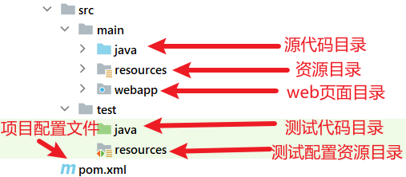

其中webapp文件夹可选


# 三. Maven基本命令使用

我们可以在cmd 中通过一系列的 maven 命令来对我们的 maven-helloworld 工程进行编译、测试、运 行、打包、安
装、部署。

## 3.1 mvn complie

compile 是 maven 工程的编译命令，作用是将 src/main/java 下的文件编译为 class 文件输出到 target 目录下。
cmd 进入命令状态，执行mvn compile，如下图提示成功：

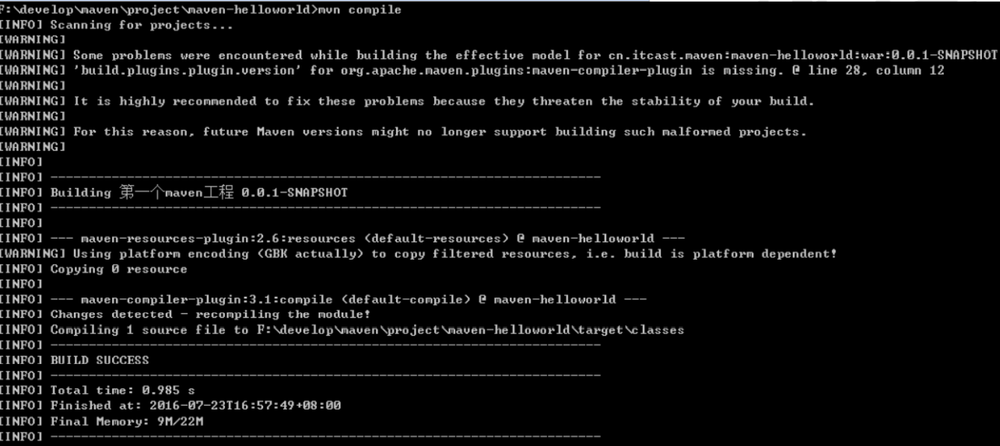

然后查看 target 目录，class 文件已生成，编译完成


## 3.2 mvn test

test 是 maven 工程的测试命令 mvn test，会执行src/test/java下的单元测试类。 cmd 执行 mvn test 执行
src/test/java 下单元测试类，下图为测试结果，运行 1 个测试用例，全部成功。

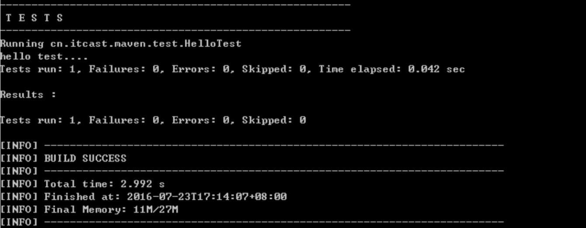


## 3.3 mvn clean

clean 是 maven 工程的清理命令，执行 clean 会删除 target 目录及内容。

## 3.4 mvn package

package 是 maven 工程的打包命令，对于 java 工程执行 package 打成 jar 包，对于web 工程打成war 包。

## 3.5 mvn install

install 是 maven 工程的安装命令，执行 install 将 maven 打成 jar 包或 war 包发布到本地仓库。 从运行结果中，可
以看出： 当后面的命令执行时，前面的操作过程也都会自动执行，

## 3.6 Maven 指令的生命周期

maven 对项目构建过程分为三套相互独立的生命周期，请注意这里说的是“三套”，而且“相互独立”， 这三套生命周期
分别是： Clean Lifecycle 在进行真正的构建之前进行一些清理工作。 Default Lifecycle 构建的核心部分，编译，测
试，打包，部署等等。 Site Lifecycle 生成项目报告，站点，发布站点。


## 3.7 maven 的概念模型

Maven 包含了一个项目对象模型 (Project Object Model)，一组标准集合，一个项目生命周期(Project Lifecycle)，一
个依赖管理系统(Dependency Management System)，和用来运行定义在生命周期阶段 (phase)中插件(plugin)目标
(goal)的逻辑。


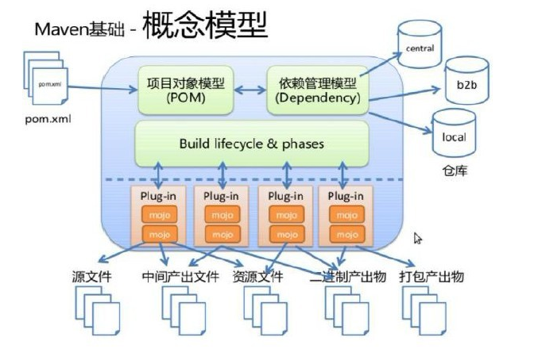

- 项目对象模型 (Project Object Model) 一个 maven 工程都有一个 pom.xml 文件，通过 pom.xml 文件定义项目
  的坐标、项目依赖、项目信息、 插件目标等。
- 依赖管理系统(Dependency Management System) 通过 maven 的依赖管理对项目所依赖的 jar 包进行统一管
  理。 比如：项目依赖 junit4.9，通过在 pom.xml 中定义 junit4.9 的依赖即使用 junit4.9，如下所示是 junit4.9
  的依赖定义：

```xml
<!-- 依赖关系 -->
<dependencies>
	<!-- 此项目运行使用 junit，所以此项目依赖 junit -->
	<dependency>
        <!-- junit 的项目名称 -->
        <groupId>junit</groupId>
        <!-- junit 的模块名称 -->
        <artifactId>junit</artifactId>
        <!-- junit 版本 -->
        <version>4.9</version>
        <!-- 依赖范围：单元测试时使用 junit -->
        <scope>test</scope>
    </dependency>
<dependencies>

```

`<scope>`标签的可选值(重要):

1. **compile** **（编译）**

   compile是默认的范围；如果没有提供一个范围，那该依赖的范围就是编译范围。编译范围依赖在所有的classpath中可用，同时它们也会被打包。

2. **provided** **（已提供）**

   provided 依赖只有在当JDK 或者一个容器已提供该依赖之后才使用。例如， 如果你开发了一个web 应用，你可能在编译 classpath 中需要可用的Servlet API 来编译一个servlet，但是你不会想要在打包好的WAR 中包含这个Servlet API；这个Servlet API JAR 由你的应用服务器或者servlet 容器提供。已提供范围的依赖在编译classpath （不是运行时）可用。它们不是传递性的，也不会被打包。

3. **runtime** **（运行时）**

   runtime 依赖在运行和测试系统的时候需要，但在编译的时候不需要。比如，你可能在编译的时候只需要JDBC API JAR，而只有在运行的时候才需要JDBC
   驱动实现。

4. **test** **（测试）**

   test范围依赖 在一般的编译和运行时都不需要，它们只有在测试编译和测试运行阶段可用。

5. **system** **（系统）**

   system范围依赖与provided类似，但是你必须显式的提供一个对于本地系统中JAR文件的路径。这么做是为了允许基于本地对象编译，而这些对象是系统类库的一部分。这样的构建应该是一直可用的，Maven 也不会在仓库中去寻找它。如果你将一个依赖范围设置成系统范围，你必须同时提供一个**systemPath**元素。注意该范围是不推荐使用的（建议尽量去从公共或定制的 Maven 仓库中引用依赖）。示例如下：

- 一个项目生命周期(Project Lifecycle) 使用 maven 完成项目的构建，项目构建包括：清理、编译、测试、部署
  等过程，maven 将这些 过程规范为一个生命周期，如下所示是生命周期的各各阶段：


maven 通过执行一些简单命令即可实现上边生命周期的各各过程，比如执行 mvn compile 执行编译、 执行 mvn
clean 执行清理。

- 一组标准集合 maven将整个项目管理过程定义一组标准，比如：通过 maven 构建工程有标准的目录结构，有
  标准的生命周期阶段、依赖管理有标准的坐标定义等。
- 插件(plugin)目标(goal) maven 管理项目生命周期过程都是基于插件完成的。


# 四. 在InteliJ IDEA中使用Maven

## 4.1 依赖导入

在POM文件中新建`<dependencies>`标签,引入想要的依赖,如图所示:

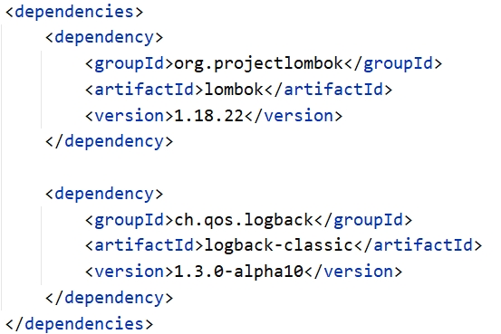

然后点击右上角maven图标刷新项目依赖(可以设置为自动刷新,最好设置为手动),如图:


## 4.2 使用Maven搜索插件

在插件市场找到**Maven Search**插件,这是一款由**源码阅读网**的鲁班大叔开发的maven搜索插件,有了它就再也不用去网上百度搜索复制粘贴了,那样很费时间.

如图:

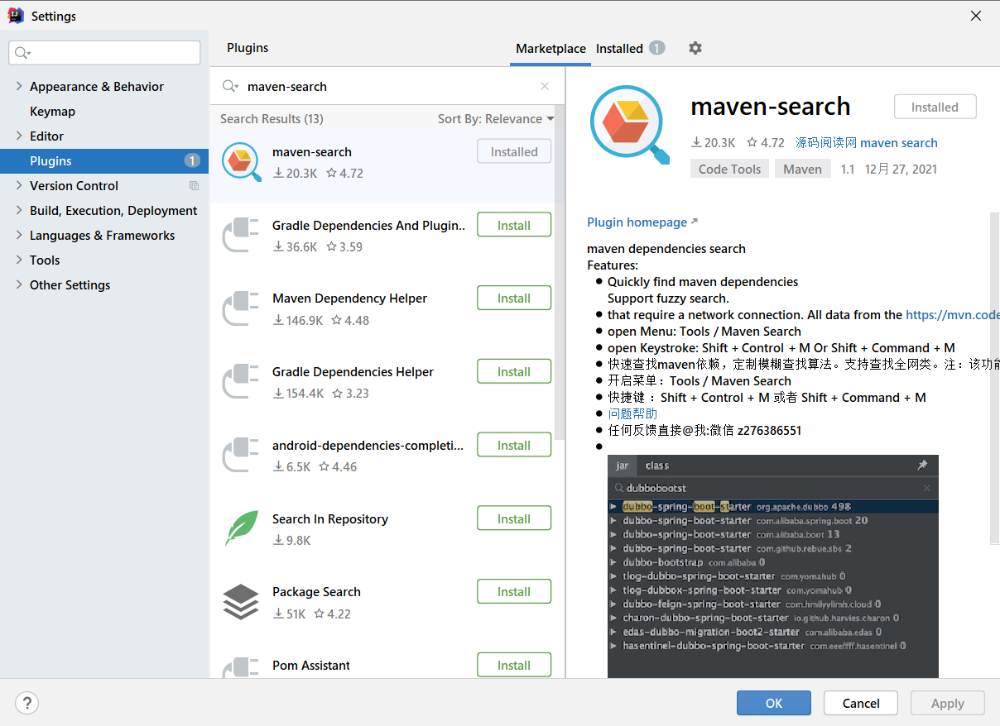


然后点击导航条**Tools**按钮,找到**Maven Search**选项:

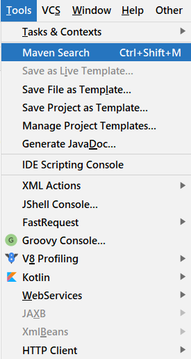


开始输入内容搜索,然后复制粘贴(对于Gradle构建工具同样适用):

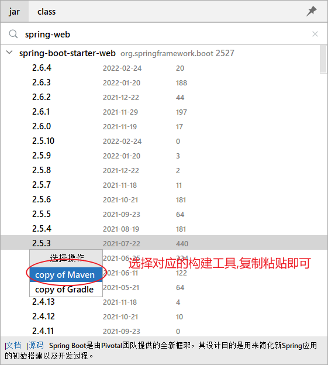


## 4.3 设置Maven的编译版本

可能有的时候,你IDEA设置的JDK版本明明是11可以编译的时候却给你报错,说什么JDK8不支持此语法,这时候就需要设置Maven的编译版本了,我这里设置的JDK11这个版本,但是你也可以设置为JDK8版本,就看项目的需求了.

```xml
<properties>
    <project.build.sourceEncoding>UTF-8</project.build.sourceEncoding>
    <maven.compiler.source>11</maven.compiler.source>
    <maven.compiler.target>11</maven.compiler.target>
</properties>
    
<build>
    <finalName>java11</finalName>
    <plugins>
        <plugin>
            <groupId>org.apache.maven.plugins</groupId>
            <artifactId>maven-compiler-plugin</artifactId>
            <configuration>
                <source>11</source>
                <target>11</target>
            </configuration>
        </plugin>
        <!--使单元测试不收项目编译影响-->
        <plugin>
            <groupId>org.apache.maven.plugins</groupId>
            <artifactId>maven-surefire-plugin</artifactId>
            <configuration>
                <testFailureIgnore>true</testFailureIgnore>
            </configuration>
        </plugin>
    </plugins>
</build>
```

