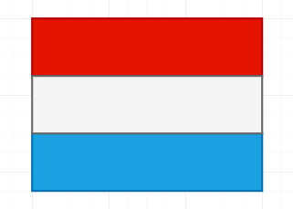
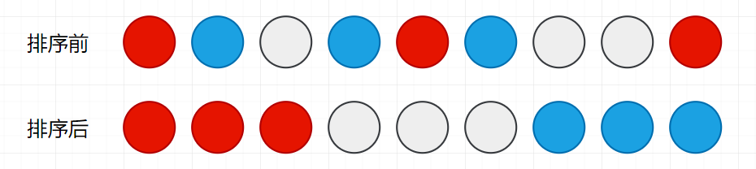

# 算法刷题套路

# 一. 位运算

## 1.1 异或运算

在 Java 中异或运算使用  `^` 符号,异或运算的性质：

1. `0 ^ N = N`
2. `N ^ N = 0`

概括讲就是: 0 跟任何数 N 异或得到的结果都是 N,任何数 N 跟自己异或得到的结果都是 0.

## 1.2 两数交换

通常情况下,我们交换两个数的传统方式都是要申请一个临时变量空间,然后进行交换.但是在了解了异或性质之后我们就可以使用异或运算来实现两数交换,这种方式不需要任何额外的内存空间,而且效率更高.

```java
public static void main(String[] args) {
    int a = 10;
    int b = 20;
    a = a ^ b;  // a + b
    b = a ^ b;  // a - b
    a = a ^ b;  // a - b
}
```

分析一下过程:

1) 初始化 a , b.
2) 执行 `a = a ^ b` 此时 a = 10 ^ 20
3) 执行 `b = a ^ b` 此时 b = 10 ^ 20 ^ 20 = 10
4) 执行 `a = a ^ b` 此时 a = 10 ^ 20 ^ 10 = 20

由于 Java **值传递**的性质,我们通常不使用方法来交换两数,因为这只是进行了一次值拷贝,并没有改变原有变量的值.但是可以用来交换数组两个不同索引的值.

```java
public static void swap(int[] keys, int i, int j) {
    if (i != j) {
        keys[i] = keys[i] ^ keys[j];
        keys[j] = keys[i] ^ keys[j];
        keys[i] = keys[i] ^ keys[j];
    }
}
```

> 分析: 为什么要求两个位置不相同? 假如两个位置的数相同,刚开始 keys[i] = 0 了,然后底下就不用看了,那个位置的数被你直接改变成 0 值了,也就是说你这次交换失败了!


## 1.3 找出出现奇数次的数

要求如下:

​		在一个数组中找出出现**奇数次**的数,假设其他的数出现的次数为偶数.

思路:

​		根据异或的性质,一个数出现偶数次,那么让这些数进行异或最后的结果就变成 0 了.比如说: 出现次数为偶数的数为 a ,偶数个 a 在一起异或:

​				`a ^ a ^ a ^ a ^ ... ^ a (偶数个) = 0 `

​		那么最后只剩下出现次数为奇数次的数,这样代码就水到渠成了.	

```java
public static int findOddTimesNum(int[] arr) {
    int xor = 0;
    for (int j : arr) {
        xor ^= j;
    }
    return eor;
}
```


## 1.4 找出两个出现奇数次的数

要求如下:

​		在一个数组中找出**两个**出现次数为奇数的数,规定其他的数出现的次数为偶数.而且这两个数是**不同的数**.

思路:

​		假设这两个数分别为 a , b.首先还是定义一个 *xor* 异或变量,遍历 arr ,然后对每一个数进行异或操作,最后就得到 *xor = a ^ b*.假设 a 和 b 的二进制形式在某一个位置上是不同的,也就是说在 N 位置上一个是 1,一个是 0.那么数组 arr 整个就**可以分成两组**,一组就是 N 位置上是 1,还有一组就是 N 位置上为 0.

​		如何得到 N?

​		很简单,**只需要将 xor 取反再跟自己异或即可得到**.得到位置 N 后,对 arr 进行二次遍历异或,过滤出 N 位置上为 0 的数和不为 0 的数,下列代码中 *onlyOne* 就是最终 N 位置上为 1 的那个数在一起异或的结果,**也就是 a 和 b 之中 N 位置上为 1 的数**,假设是 a.然后再拿  *xor* 和 *onlyOne* 异或即可得到 b.

```java
public static int[] findTheTwoNumberOddTimes(int[] arr) {
    int[] ans = new int[2];
    int xor = 0;
    for (int i : arr) {
        xor ^= i;
    }
    
    // 现在只得到两个出现次数为奇数的数异或之后的结果
    // 得到最右边1的位置
    int rightOne = xor & (-xor);
    int onlyOne = 0;
    
    for (int j : arr) {
        if ((j & rightOne) != 0) {  // 表示在最右边的位置上存在1
            onlyOne ^= j;
        }
    }
    ans[0] = onlyOne;
    ans[1] = xor ^ onlyOne;
    return ans;
}
```


## 1.5 找出出现K次的数

要求如下:

​		一个数组中有一个数出现 k 次,其他数都出现了 m 次, m > 1, k < m,编写程序找到出现 k 次的数,要求额外空间复杂度 O(1),时间复杂度 O(N).

```java
public static int findKTimes(int[] arr, int k, int m) {
    int[] t = new int[32];

    // t[0]代表0位置的1出现了几次
    // t[i]代表i位置的1出现了几次
    for (int num : arr) {
        for (int i = 0; i < 31; i++) {
            // 表示在i位置上不是0
            if (((num >> i) & 1) != 0) {
                t[i]++;
            }
        }
    }

    int ans = 0;
    for (int i = 0; i < 31; i++) {
        if (t[i] % m != 0) {  // 在第i位置上有1
            ans |= (1 << i);
        }
    }
    return ans;
}
```


# 二. 基础的数据结构

## 2.1 链表


## 2.2 栈和队列


## 2.3 理解递归


## 2.4 Master公式


## 2.5 哈希表和有序表


# 三. 归并和快速排序

### 3.1 归并排序

**归并排序**即两个有序的数组归并成一个更大的有序数组.很快人们就根据这个操作发明了一种简单的递归排序算法: **归并排序**.要将一个数组排序,可以鲜(递归地)将它分成两半分别排序,然后将结果归并起来.归并排序最吸引人的性质是它能保证将任意长度为 N 的数组排序所所需时间和 NlogN 成正比,它的主要缺点则是它所需的额外空间和 N 成正比.

最核心的思想就是归并(merge),将两个数组合并到一起,merge 方法表示二路归并一个数组,参数 l 和 r 指定区间的两端, m 表示区间的中点.再声明两个指针分别为 p1 和 p2 分别指向要归并的两段的开始,然后遍历数组比较量元素大小(默认升序排列),然后存入辅助数组, m 和 r 就是两个指针的终点了.

代码如下:

```java
// 表示归并数组的哪一段区间,l 和 r 指定区间,m 为中点
public static void merge(int[] arr, int l, int m, int r) {
    // 声明一个辅助数组
    int[] helper = new int[r - l + 1];
    int i = 0;
    int p1 = l;
    int p2 = m + 1;
    
    while (p1 <= m && p2 <= r) {
        helper[i++] = arr[p1] <= arr[p2] ? arr[p1++] : arr[p2++];
    }
    
    // 要么p1越界了,要么p2越界了,开始拷贝剩下的数据到helper数组里面,
    // 两个while只会发生一个,接下来收集剩下的元素
    while (p1 <= m) {
        helper[i++] = arr[p1];
    }
    
    while (p2 <= r) {
        helper[i++] = arr[p2];
    }
    
    // 把辅助数组中的元素拷贝到原数组中
	for (int i = 0; i < helper.length; i++) {
        arr[l + i] = helper[i];
    }
}
```

实现了这个思想之后,就可以解决一些问题了,排序算法基础详见**排序算法.md**.比如说: 解决**小和问题**.

在一个数组中,每一个数左边比当前数小的数累加起来,叫做这个数组的小和.求一个数组的小和称为小和问题.

```
input: [2,4,5,1,7,3]
2 左侧比 2 小的数，没有；
4 左侧比 4 小的数，2；
5 左侧比 5 小的数，2,4；
1 左侧比 1 小的数，没有；
7 左侧比 7 小的数，2,4,5,1；
3 左侧比 3 小的数，2,1。

output: 2+2+4+2+4+5+1+2+1=23
```

此处使用归并排序，在 merge 时，由于左右两部分都已经有序，可以确定一侧的数都大于正在比较的数，例如：

归并 `2 4 5 | 1 3 7` 两个部分时,2  比 3 小,此时可以确定后面的数都大于 2,此时便可以一次性计算小和 2 * 2(两个数大于 2),而不用一个个遍历.使用归并排序算法的快速之处在于.归并的两个部分对内都是有序的,如 `2 4 5 | 1 3 7` 两个部分.因此在比较大小的时候,可以迅速确定整批的数据大小,而不用重复遍历计算.

又由于每一次 merge 的数据都是新的，此前没有重复算过，因此不会多次计算或漏算。

```java
public static int smallSum(int[] arr) {
    if (arr == null || arr.length < 2) {
        return 0;
    }
    return process(arr, 0, arr.length - 1);
}

/**
 * arr[l...r]既要排好序,也要求小和返回
 * 所有 merge 时,产生的小和累加
 * 左排序,右排序
 */
private static int process(int[] arr, int l, int r) {
    if (l == r) {
        return 0;
    }

    int mid = l + ((r - l) >> 1);

    return process(arr, l, mid) + 
        process(arr, mid + 1, r) + 
        merge(arr, l, mid, r);
}

private static int merge(int[] arr, int l, int m, int r) {
    int[] helper = new int[r - l + 1];
    int i = 0;
    int p1 = l;
    int p2 = m + 1;
    int ans = 0;

    // 简而言之就是求出右边一组有多少个比当前值大的数,然后累加,然后下面照样归并排序
    while (p1 <= m && p2 <= r) {
        // 求小和关键代码
        ans += arr[p1] < arr[p2] ? (r - p2 + 1) * arr[p1] : 0;  
        helper[i++] = arr[p1] <= arr[p2] ? arr[p1++] : arr[p2++];
    }

    while (p1 <= m) {
        helper[i++] = arr[p1++];
    }

    while (p2 <= r) {
        helper[i++] = arr[p2++];
    }

    for (i = 0; i < helper.length; i++) {
        arr[l + i] = helper[i];
    }

    return ans;
}
```


### 3.2 快速排序

快速排序的核心思想就是**划分 (partition)**,选取数组中的一个数作为基准(pivot),然把数组分为 3 块,一块是小于标准的数,一块是和标准相等的数,第三块是大于标准的数.

代码如下:

```java
public static int partition(int[] arr, int l, int r) {
    if (l > r) {
    	return -1;
    } else if (l == r) {
    	return 1;
    }

    int lessEqual = l - 1;
    int index = l;

    while (index < r) {
    	if (arr[index] <= arr[r]) {
    	swap(arr, index, ++lessEqual);
    }

    	index++;
    }

    swap(arr, ++lessEqual, r);
    return lessEqual;
}
```

基于快速排序,可以解决一些常见的实际问题,比如: 荷兰国旗问题.**荷兰国旗问题：现在有若干个红、白、蓝三种颜色的球随机排列成一条直线。现在我们的任务是把这些球按照红、白、蓝排序。**这个问题之所以叫荷兰国旗，是因为我们可以将红白蓝三色小球想象成条状物，有序排列后正好组成荷兰国旗。






代码如下:

```java
/**
 * arr[L...R] 玩荷兰国旗问题的划分，以arr[R]做划分值
 * < arr[R] ==arr[R] > arr[R]
 * 此种方法可以确定一批中间数,避免重复计算
 * 方法返回与基准数相等的数的区间
 */
public static int[] netherlandsFlag(int[] arr, int l, int r) {
    if (l > r) { // L...R L>R
        return new int[]{-1, -1};
    } else if (l == r) {
        return new int[]{l, r};
    }

    int less = l - 1; // < 区 右边界
    int more = r; // > 区 左边界
    int index = l;

    while (index < more) { // 当前位置，不能和 >区的左边界撞上
        if (arr[index] == arr[r]) {
            index++;
        } else if (arr[index] < arr[r]) {
//				swap(arr, less + 1, index);
//				less++;
//				index++;						
            swap(arr, index++, ++less);
        } else { // >
            swap(arr, index, --more);
        }
    }

    swap(arr, more, r); // <[R]   =[R]   >[R]
    return new int[]{less + 1, more};
}
```


# 四. 堆排序
