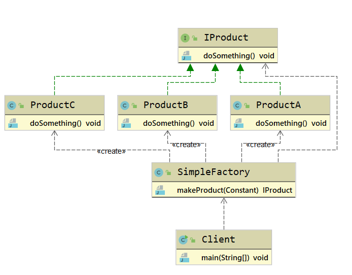
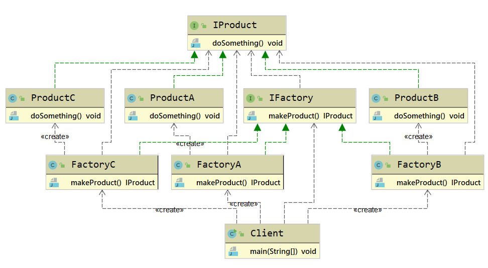
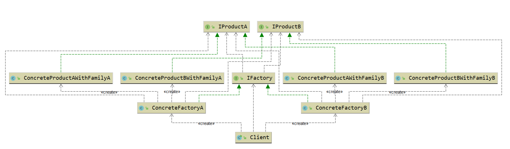
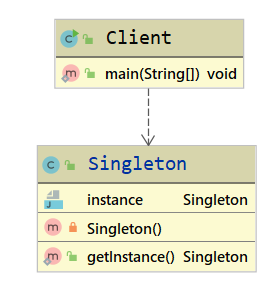
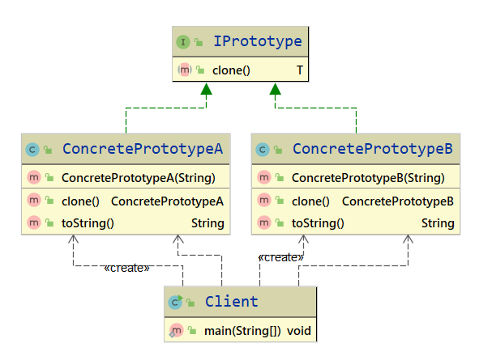
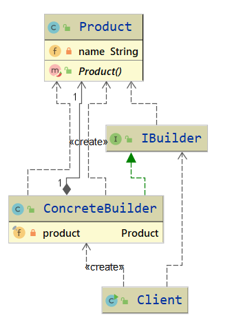

# 四.创建型设计模式

## 4.1 简单工厂模式

### 4.1.1 简单工厂模式定义

​	简单工厂模式(Simple Factory Pattern)又叫作静态工厂方法模式(Static Factory Method Pattern),简单来说,简单工厂模式有一个具体的工厂类,可以生成多个不同的产品,属于创建型设计模式.简单工厂模式不在GoF23种设计模式之列.

### 4.1.2 简单工厂模式应用场景

​	对于产品种类相对较少的情况,考虑使用简单工厂模式可以很方便地创建所需产品.使用简单工厂模式的客户端只需要传入工厂类的参数,不需要关心如何创建对象的逻辑.

### 4.1.3 简单工厂模式UML类图

​	

简单工厂模式主要包含3个角色:

1. **简单工厂(SimpleFactory)**: 是简单工厂模式的核心,负责实现创建所有实例的内部逻辑.工厂类的创建产品类的方法可以被外界直接调用,创建所需的产品对象.
2. **抽象产品(IProduct)**: 是简单工厂创建的所有对象的父类,负责描述所有实例共有的公共接口.
3. **具体产品(Product)**: 是简单工厂模式的创建目标.

### 4.1.4 扩展

#### 简单工厂模式优点

​	简单工厂模式的结构简单,调用方便,对于外界给定的信息,可以很方便地创建出相应的产品,工厂和产品的职责区分明确.

#### 简单工厂模式的缺点

​	简单工厂模式的工厂类单一,负责所有产品的创建,但产品基数增多时,工厂类代码会非常臃肿,违背高聚合原则.

## 4.2 工厂方法模式

### 4.2.1 工厂方法模式定义

​	工厂方法模式(Factory Method Pattern)又叫作多态性工厂模式,指定义一个创建对象的接口,但由实现这个接口的类来决定实例化哪个类,工厂方法把类的实例化推迟到子类中进行.

> **Define an interface for creating an object, but let subclasses decide which class to instantiate. Factory Method lets a class defer instantiation to subclasses.**	

​	在工厂方法模式中,不在由单一的工厂类生产产品,而是由工厂类的子类实现具体产品的创建.因此,当增加一个产品时,只需要增加一个相应的工厂类的子类,实现生产这种产品,便可以解决简单工厂生产太多导致其内部代码臃肿(switch... case分支过多)的问题,也符合开闭原则.

### 4.2.2 工厂方法使用场景

1. 创建对象需要大量的重复代码
2. 客户端(应用层)不依赖产品类的实例如何被创建,实现等细节
3. 一个类通过其子类来指定创建哪个对象

### 4.2.3 工厂模式的UML类图

 

工厂方法模式主要包含4个角色

1. **抽象工厂(IFactory)**: 是工厂方法模式的核心,与应用程序无关.任何模式中创建的抽象工厂类必须实现这个接口.
2. **具体工厂(ConcreteFactory)**: 是实现抽象工厂接口的具体工厂类,包含与应用程序密切相关的逻辑,并且被应用程序调用用以创建产品对象.
3. **抽象产品(IProduct)**: 是工厂方法模式所创建的对象的超类,也就是产品对象的共同类或共同拥有的接口.
4. **具体产品(ConcreteProduct)**: 这个角色实现了抽象产品角色所定义的接口.某具体产品由专门的具体分工厂创建,它们之间往往一一对应.

### 4.2.4 工厂方法模式扩展

#### 工厂方法模式优点

1. 灵活性强,对新产品的创建,只需要多写一个相应的工厂类.
   2. 典型的解耦框架.高层模块只需要知道产品的抽象类,无须关心其他实现类,满足迪米特法则,依赖倒置原则和里氏替换原则.

#### 工厂方法模式缺点

1. 容易类爆炸,增加复杂度.
2. 增加了系统的抽象性和理解难度.
3. 抽象产品只能生产一种产品,此弊端可使用抽象工厂模式解决.

## 4.3 抽象工厂模式

### 4.3.1 抽象工厂模式定义

​	抽象工厂模式(Abstract Factory Method)指提供一个创建一系列或相互依赖对象的接口,无须指定它们具体的类.意思是客户端不必指定产品的具体类型,创建多个产品族中的产品.

> **Provide an interface for creating families of related or dependent objects without specifying their concrete classes;**

​	在抽象工厂模式中,客户端(应用层)不依赖产品类实例如何被创建,实现等细节,强调一系列相关的产品对象(属于同一产品族)一起创建对象,需要大量重复的代码.

​	需要提供一个产品类的库,所有的产品以同样的接口实现,从而使客户端不依赖具体实现.

### 4.3.2 抽象工厂模式使用场景

​	抽象工厂模式适用于需要生成产品族的情景.抽象产品类内部提供了多个其他抽象产品,抽象工厂类定义了产品的创建接口通过具体的工厂子类,就可以生产相应的产品族对象,供用户端使用.

### 4.3.3 抽象工厂模式的UML类图

抽象工厂主要包含4个角色:

1. **抽象工厂(IFactory)**: 声明创建抽象产品对象的一个操作接口.
2. **具体工厂(ConcreteFactory)**: 实现创建具体产品对象的操作
3. **抽象产品(IProduct)**: 为一类产品对象声明一个接口
4. **具体产品(ConcreteProduct)**: 定义一个将被相应的具体工厂创建的产品对象**IProduct**接口

### 4.3.4 抽象工厂模式扩展

#### 抽象工厂模式优点

1. 当需要产品族时,抽象工厂可以保证客户端始终只有同一个产品的产品族
2. 抽象工厂增强了程序的可扩展性,对于新产品族的增加,只需要实现一个新的具体工厂即可,不需要对已有代码进行修改,符合开闭原则.

#### 抽象工厂模式缺点

1. 规定了所有可能被创建的产品集合,产品族中扩展新的产品困难,需要修改抽象工厂的接口.
2. 增加了系统的抽象性和理解难度

## 4.4 单例模式

### 4.4.1 单例模式定义

​	单例模式(Singleton Pattern)指确保一个类在任何情况下都绝对只有一个实例,并提供一个局部访问点,属于创建型设计模式.

> **Ensure a class has only one instance, and provide a global point of access to it.**

### 4.4.2 单例模式使用场景

​	单例模式在现实生活中的应用非常广泛,例如公司CEO,部门经理等都属于单例模式.**J2EE**标准中的**ServletContext**和**ServletContextConfig**,**Spring**框架应用中的**ApplicationContext**,数据库中的连接池都是单例模式.对于**Java**来说单例模式可以保证在一个**JVM**中只存在单一实例.单例模式的应用场景主要有以下几个方面:

1. 需要频繁创建的一些类,使用单例模式可以降低系统的内存压力减少GC.
2. 某些类创建实例时占用资源较多,或实例化耗时较长,且经常使用.
3. 频繁访问数据库或文件的对象.
4. 对于一些控制硬件级别的操作,或者从系统上来讲应当是单一控制逻辑的操作,如果有多个实例则,系统会完全乱套.

### 4.4.3 单例模式UML类图

Singleton类被称为单例类,通过隐藏构造方法,在内部初始化一次,并提供一个全局的访问点.

### 4.4.4 单例模式扩展

#### 单例模式优点

1. 单例模式可以保证内存里只有一个实例,减少了内存的开销
2. 可以避免对资源的多重占用
3. 单例模式可以设置全局访问点,可以优化和共享资源的访问

#### 单例模式缺点

1. 单例模式一般没有接口,扩展困难.如果要扩展,则除了修改原来的代码,没有第二种途径,违背开闭原则.
2. 在并发测试中,单例模式不利于代码调试,在测试过程中,如果单例中的代码没有执行完,也不能模拟生成一个新的对象.
3. 单例模式的功能代码通常写在一个类中,如果功能设计不合理,则容易违背单一职责原则.

## 4.5 原型模式

### 4.5.1 原型模式定义

​	原型模式(Prototype Pattern)指原型实例指定创建对象的种类,并且通过复制这些原型创建新的对象,属于创建型设计模式.

> **Specify the kinds of objects to create using a prototypical intance, and create new objects by copying this prototype.**

​	原型模式的核心在于复制原型对象.以系统中已存在的一个对象为原型,直接基于内存二进制流进行复制,不需要再经历耗时的对象初始化过程(不调用构造函数),性能提升许多.当对象的构建过程比较耗时的时候,可以把当前系统中已存在的对象作为原型,对其进行复制(一般是基于二进制流的复制),躲避初始化过程,使得对象的创建时间大大缩短.

### 4.5.2 原型模式使用场景

1. 创建对象成本较大(例如,初始化时间长,占用CPU太多,或者占用网络资源太多等)需要优化资源.
2. 创建一个对象需要繁琐的数据准备或访问权限等,需要提高性能或者提高安全性.
3. 系统中大量使用该类对象,且各个调用者都需要给它的属性重新复制.

### 4.5.3 原型模式UML类图

原型模式主要包含3个角色:

1. **客户(Client)**: 客户提出创建对象的请求.
2. **抽象原型(IPrototype)**: 规定复制接口
3. **具体原型(ConcretePrototype)**: 被复制的对象

> **不是通过new关键字而是通过对象复制来实现创建对象的模式被称为原型模式**

### 4.5.4 原型模式扩展

#### 原型模式优点

1. Java自带的原型模式基于内存二进制流的复制,在性能上比直接new一个对象更加优良.
2. 可以使用深克隆方式保存对象的状态,使用原型模式将对象复制一份,并将其状态保存起来,简化了创建对象的过程,以便在需要的时候使用(例如恢复到历史某一状态),可辅助实现撤销操作.

#### 原型模式缺点

1. 需要为每一个类都配置一个clone方法.
2. clone方法位于类的内部,当对已有类进行改造时,需要修改代码,违背了开闭原则.
3. 当实现深克隆时候,需要编写较为复杂的代码,而且当对象之间存在多重嵌套引用时,为了实现深克隆,每一层对象对应的类都必须支持深克隆,实现起来比较麻烦.因此,深克隆,浅克隆需要运用得当.

## 4.6 建造者模式

### 4.6.1 建造者模式定义

​	建造者模式(Builder Pattern)将一个复杂对象的构建过程与它的表示分离,使得同样的构建过程可以创建不同的表示,属于创建型设计模式.

> **Separate the construction of a complex object from its representation so that the same construction process can create different representations.**

​	对于用户而言,使用建造者模式只需要指定需要创建的类型就可以获得对象,创建过程及细节不需要了解.根据建造者模式的定义,可以简单地理解为两层含义.

1. 构建与表示分离: 构建代表对象创建,表示代表对象行为,方法.也就是将对象的创建与行为进行分离(对应到Java代码,其实就是使用接口规定行为,然后由具体的实现进行构建)
2. 创建不同的表示: 也就是具备同样的行为,但是却由于构建的行为顺序不同或其他原因可以创建不同的表示.

### 4.6.2 建造者模式使用场景

1. 相同的方法,不同的执行顺序,产生不同的结果
2. 多个部件或零件,都可以装配到一个对象中,但是产生的结果又不相同
3. 产品类非常复杂,或者产品类中不同的调用顺序产生不同的作用
4. 初始化一个对象特别复杂,参数多,而且很多参数都具有默认值

### 4.6.3 建造者模式UML类图

建造者模式主要包含4个角色:

1. **产品(Product)**: 要创建的产品类对象
2. **抽象建造者(IBuidler)**: 建造者的抽象类,规范产品对象的各个组成部分的创建,一般由子类实现具体的创建过程
3. **建造者(Concrete Builder)**: 具体的Builder类,根据不同的业务逻辑,具体化对象的各个组成部分的创建
4. **调用者(Director)**: 调用具体的建造者,来创建对象的各个部分,在指导者中不涉及具体产品的信息,只负责保证对象各部分完整创建或者按某种顺序创建,在类图中,Client相当于调用者的角色

### 4.6.4 建造者模式扩展

#### 建造者模式与工厂模式区别

1. 建造者模式更加注重方法的调用顺序,工厂模式注重创建对象
2. 创建对象的力度不同,建造者模式创建复杂的对象,由各种复杂的部件组成,工厂模式创建出来的对象都一样
3. 关注重点不一样,工厂模式只需要把对象创建出来就可以了,而建造者模式不仅要创建出对象,还要知道对象由哪些部件组成
4. 建造者模式根据建造过程中的顺序不一样,最终的对象部件组成不一样

#### 建造者模式优点

1. 封装性好,构建和表示分离
2. 扩展性好,建造类之间独立,在一定程度上解耦合
3. 便于控制细节,建造者可以对创建过程逐步细化,而不对其他模块产生任何影响

#### 建造者模式缺点

1. 需要多创建一个**IBuilder**对象
2. 如果产品内部发生变化,则建造者也要同步修改,后期维护成本较大
