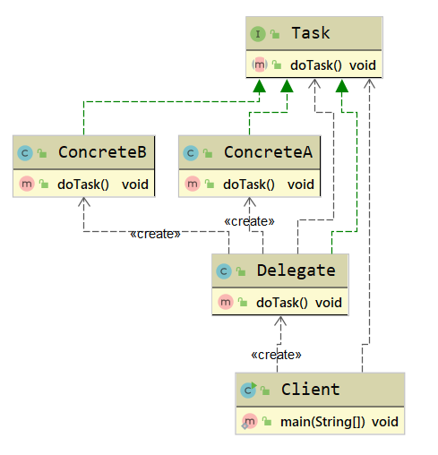

# 六. 行为型设计模式

## 6.1 委派模式

### 6.1.1 委派模式定义

​	委派模式(Delegate Pattern)又叫作委托模式,是一种面向对象的设计模式,允许对象组合实现与继承相同的代码重用.它的基本作用就是负责任务的调用和分配,是一种特殊的静态代理模式,可以理解为全权代理模式,但是代理模式注重过程,而委派模式注重结果.委派模式属于行为型设计模式,不属于GoF的23种设计模式.

### 6.1.2 委派模式使用场景

1. 需要实现表现层和业务层之间松耦合
2. 需要编排多个服务之间的调用
3. 需要封装一层服务查找和调用

### 6.1.3 委派模式UML类图

委派模式主要有3个角色:

1. **抽象任务角色(ITask)**: 定义一个抽象接口,它有若干实现类
2. **委派者角色(Delegate)**: 负责在各个具体角色实例之间做出决策,判断调用具体实现的方法
3. **具体任务角色(Concrete)**: 真正执行任务的角色

### 6.1.4 委派模式扩展

#### 委派模式优点

​	通过任务委派能够将一个大型任务细化,然后通过统一管理这些子任务的完成情况实现任务的跟进,加快任务执行的效率

#### 委派模式缺点

​	任务委派方式需要根据任务的复杂程度进行不同的改变,在任务比较复杂的情况下,可能需要进行多重委派,容易造成紊乱

## 6.2 模板方法模式

### 6.2.1 模板方法模式定义

​	**模板方法模式(Template Method Pattern)**又叫作模板模式,指定义一个操作中的算法框架,而将一些步骤延迟到子类中,使得子类可以不改变一个算法的结构即可重定义该算法的某些特定步骤,属于行为型设计模式

> **Define the skeleton of an algorithm in an operation, deferring some steps to subclasses.Template Method lets subclasses redefine certain steps of an algorithm without changing the algorithm's structure**

## 6.3 策略模式

## 6.4 责任链模式

## 6.5 迭代器模式

## 6.6 命令模式

## 6.7 状态模式

## 6.8 备忘录模式

## 6.9 中介者模式

## 6.10 解释器模式

## 6.11 观察者模式

## 6.12 访问者模式