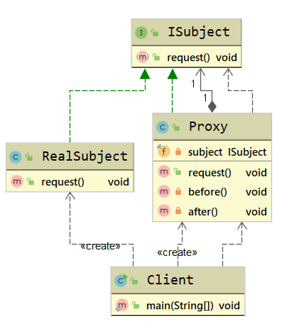
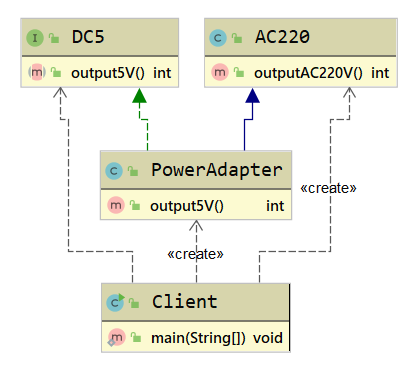

# 五. 结构型设计模式

## 5.1 代理模式

### 5.1.1 代理模式定义

​	代理模式(Proxy Pattern)指为其他对象提供一种代理,以控制对这个对象的访问,属于结构型设计模式.

> **Provide a surrogate or placeholder for another object to control access to it**

​	在某些情况下,一个对象不适合或者不能直接引用另一个对象,而代理对象可以在客户端与目标对象之间起到中介作用.

### 5.1.2 代理模式使用场景

​	当无法或不想直接引用某个对象或访问某个对象存在困难时,可以通过代理对象来间接访问,使用代理模式主要有两个目的: 一是保护目标对象,二是增强目标对象.

### 5.1.3 代理模式UML类图

代理模式包含3个角色:

1. **抽象主题角色(ISubject)**: 抽象主题类的主要职责是声明真实主题与代理的共同接口方法,该类可以是接口,也可以是抽象类.
2. **真实主题角色(RealSubject)**: 该类也被称为代理类,该类定义了代理所表示的真实对象,是负责执行系统的真正的逻辑业务对象.
3. **代理主题角色(Proxy)**: 也被称为代理类,其内部持有RealSubject的引用,因此具备完全的对RealSubject的代理权.客户端调用代理对象的方法,也被调用被代理的方法,但是会在代理对象前后增加一些处理代码.

在代码中,一般代理会被理解为代码增强,实际上就是在原代码逻辑前后增加一些代码逻辑,而使调用者无感知.代理模式分为**静态代理**和**动态代理**.

## 5.2 门面模式

### 5.2.1 门面模式定义

​	门面模式(Facade Pattern)又叫作外观模式,提供了一个统一的接口,用来访问子系统的一群接口.其主要特征是定义了一个高层接口,让子系统更容易使用,属于结构型设计模式.

> **Provide a unified interface to a set of interfaces in a subsystem. Facade defines a higher-level interface that makes the subsystem easier to use**

​	在工作中,使用门面模式大多在整合第三方SDK开源类库的时候使用,提供一个统一的接口.

### 5.2.2 门面模式使用场景

 	1. 为一个复杂的模块或子系统提供一个简洁的供外界访问的接口
 	2. 希望提高子系统的独立性
 	3. 当子系统由于不可避免的暂时原因导致可能存在bug或性能相关的问题时,可以通过门面模式提供一个高层接口,隔离客户端与子系统的直接交互,预防代码污染

### 5.2.3 门面模式UML类图

门面模式主要包含2个角色:

1. **外观角色(Facade)**: 也叫作门面角色,是系统对外的统一接口
2. **子系统角色(SubSystem)**: 可以同时有一个或多个SubSystem.每个SubSystem都不是一个单独的类,而是一个类的集合.SubSystem并不知道Facade的存在,对于SubSystem而言,Facade只是另一个客户端而已(即Facade对SubSystem透明)

### 5.2.4 门面模式扩展

#### 门面模式优点

1. 简化了调用过程,不用深入了解子系统,以防给子系统带来风险
2. 减少系统依赖,松散耦合
3. 更好地划分访问层次,提高了安全性
4. 遵循迪米特法则

#### 门面模式缺点

1. 当子系统和扩展子系统行为时,可能容易带来未知风险
2. 不符合开闭原则
3. 某些情况下,可能违背单一职责原则

## 5.3 装饰器模式

### 5.3.1 装饰器模式定义

​	装饰器模式(Decorator Pattern)也叫作包装器模式(Wrapper Pattern),指在不改变原有对象的基础上,动态地给一个对象添加一些额外的职责.就增加功能来说,装饰器模式相比生成子类更为灵活,属于结构型设计模式.

> **Attach additional responsibilities to an object dynamically keeping the same interface.Decorators provide a flexible alternative to subclassing for extending functionality.**

​	装饰器模式提供了比继承更有弹性的替代方案(扩展原有对象的功能)将功能附加到对象上,因此,装饰器模式的核心是功能扩展.使用装饰器模式可以透明且动态地扩展类的功能.

### 5.3.2 装饰器模式使用场景

1. 用于扩展一个类的功能,或者给一个类添加附加职责
2. 动态地给一个对象添加功能,这些功能可以再动态地被撤销
3. 需要为一批平行的兄弟类进行改装或加装功能

### 5.3.3 装饰器模式UML类图

装饰器模式主要包含4个角色:

1. **抽象组件(Component)**: 可以使一个接口或者抽象类,充当被装饰类的原始对象,规定了被装饰对象的行为
2. **具体组件(ConcreteComponent)**: 实现/继承**Component**的一个具体对象,即被装饰对象
3. **被装饰器(Decorator)**: 通用的装饰**ConcreteComponent**的装饰器,其内部必然有一个属性指向**Component**: 其实现一般是一个抽象类,主要为了让其子类按照其构造形传入一个**Component**,这是强制的通用行为.如果系统系统中装饰逻辑单一,则并不需要实现许多装饰器,可以直接省略该类,而直接实现一个具体装饰器即可
4. **具体装饰器(ConcreteDecorator)**: **Decorator**的具体实现类,理论上,每个**ConcreteDecorator**都扩展了**Component**对象的一种功能

> **装饰器模式角色分配符合设计模式的<u>里氏替换原则</u>,<u>依赖倒置原则</u>,从而使得其具备很强的扩展性,最终满足开闭原则.**

装饰器模式的实现原理是,让装饰器实现与被装饰类相同的接口,使得装饰器与被扩展类类型一致,并在构造函数中传入该接口对象,然后在实现这个接口的被包装类对象的现有功能上添加新功能,由于装饰器与被包装类属于同一类型(均为Component)且构造函数的参数为其实现接口类,因此装饰器模式具备嵌套扩展功能,这样就能使用装饰器模式一层一层地对被包装类进行工扩展了

### 5.3.4 装饰器模式扩展

#### 装饰器模式与代理模式区别

​	装饰器模式强调自身功能的扩展.Decorator所做的就是增强ConcreteComponent的功能(也有可能减弱功能),主题对象为ConcreteComponent,着重类功能的变化

​	代理模式强调对代理过程的控制.Proxy完全掌握对RealSubject的访问控制,因此,Proxy可以决定对RealSubject进行功能的扩展,功能缩减甚至功能散失(不调用RealSubject方法),主体对象为Proxy.

#### 装饰器模式优点

1. 装饰器是继承的有力补充,比继承灵活,在不改变原有对象的情况下,动态地给一个对象扩展功能,即插即用
2. 通过使用不同的装饰器及这些装饰类的排列 组合,可以实现不同效果
3. 装饰器模式完全遵守开闭原则

#### 装饰器模式缺点

1. 会出现更多的代码,更多的类,增加程序的复杂性
2. 动态装饰在多层装饰时会更复杂

## 5.4 享元模式

### 5.4.1 享元模式定义

​	享元模式(Flyweight Pattern)又叫作轻量级模式,是对象池的一种实现,类似线程池,线程池可以避免不停地创建和销毁多个对象,消耗性能.享元模式提供了减少对象数量从而改善应用所需的对象结构的方式.其宗旨是共享细粒度对象,将多个对同一对象的访问集中起来,不必为每个访问者创建一个单独的对象,可以来降低内存的消耗,属于结构型设计模式.

> **Use sharing to support large numbers of fine-grained objects efficiently**

​	享元模式把一个对象的状态分成内部状态和外部状态,内部状态是不变的,外部状态是变化的,然后通过共享不变的部分,达到减少对象数量并节约内存的目的.

### 5.4.2 享元模式使用场景

1. 常用于系统底层的开发,以便解决系统的性能问题
2. 系统有大量相似对象,需要缓冲池的场景

### 5.4.3 享元模式UML类图

享元模式主要包含3个角色:

1. **抽象享元角色(IFlyweight)**: 享元对象抽象基类或者接口,同时定义出对象的外部状态和内部状态的接口或实现
2. **具体享元角色(ConcreteFlyweight)**: 实现抽象角色定义的业务,该角色的内部状态处理应该与环境无关,不会出现一个操作改变内部状态的情况
3. **享元工厂(FlyweightFactory)**: 负责管理享元对象池和创建享元对象

### 5.4.4 享元模式扩展

#### 享元模式优点

1. 减少对象的创建,降低内存中对象的数量,降低系统的内存,提高效率
2. 减少内存之外的其他资源占用

#### 享元模式缺点

1. 关注内,外部状态,关注线程安全问题
2. 使系统,程序的逻辑复杂化

## 5.5 组合模式

### 5.5.1 组合模式定义

​	组合模式(Composite Pattern)又叫作整体-部分(Part-Whole)模式,它的宗旨是通过将单个对象(叶子节点)和组合对象(树枝节点)用相同的接口进行表示,使得客户对单个对象和组合对象的使用具有一致性,属于结构型设计模式.

> **Compose objects into tree structures to represent part-whole hierarchies.Composite lets clients treat individual objects and compositions of obejcts uniformly**

​	组合模式一般用来描述整体与部分的关系,它将对象组织到树形结构中,顶层的节点被称为根节点,根节点下面可以包含树枝节点和叶子节点,树枝节点下面又可以包含树枝节点和叶子节点.

### 5.5.2 组合模式使用场景

1. 希望客户端可以忽略组合对象与单个对象的差异
2. 对象层次具备整体和部分,呈树形结构

### 5.5.3 组合模式UML类图

### 5.5.4 组合模式扩展

#### 组合模式优点

1. 清楚地定义各层次的复杂对象,表示对象的全部或部分层次
2. 让客户端忽略了层次的差异,方便对整个层次结构进行控制
3. 简化客户端代码
4. 符合开闭原则

#### 组合模式缺点

1. 限制类型时会较为复杂
2. 使设计变得更加抽象

## 5.6 适配器模式

### 5.6.1 适配器模式定义

​	**适配器模式(Adapter Pattern)**又叫作变压器模式,它的功能是将一个类的接口变成客户端所期望的另一种接口,从而使得原本因接口不匹配而导致无法在一起工作的两个类能一起工作,属于结构型设计模式.

> **Convert the interface of a class into anothor clients expect.Adapter lets classes work together that couldn't otherwise beacause of incompatible interfaces**

​	在软件开发中,基本上任何问题都可以通过增加一个中间层来解决.适配器模式其实就是一个中间层.适配器模式起着转化/委托的作用,将一种接口转化为另一种符合需求的接口.

### 5.6.2 适配器模式使用场景

1. 已存在的类,它的方法和需求不匹配(方法结果相同或相似)的情况
2. 适配器模式不是软件设计阶段考虑的设计模式,是随着软件维护,由于不同的产品,不同厂家造成功能类似而接口不相同情况下的解决方案,有种亡羊补牢的感觉

### 5.6.3 适配器模式UML类图

适配器模式一般有3种形式: 类适配器,对象适配器,接口适配器.适配器一般包含3个角色:

1. **目标角色(ITarget)**: 也就是我们期望的接口
2. **原角色(Adaptee)**: 存在于系统中,是指内容满足客户需求(需转换)但接口不匹配的接口实例
3. **适配器(Adapter)**: 将Adaptee转化为目标角色ITarget的类实例

### 5.6.4 适配器模式扩展

#### 适配器模式和装饰器模式区别

适配器模式和装饰器模式都是包装器模式(Wrapper Pattern),装饰器模式其实就是一种特殊的代理模式

| 对比维度 | 适配器模式                                                   | 装饰器模式                                                   |
| -------- | ------------------------------------------------------------ | ------------------------------------------------------------ |
| 形式     | 没有层级关系                                                 | 一种非常特殊的代理模式,有层级关系                            |
| 定义     | 适配器和被适配者没有必然的联系,通常采用继承或代理的形式进行包装 | 装饰器和被装饰这都实现同一个接口,主要目的是扩展之后也就是OOP关系 |
| 关系     | 满足has-a的关系                                              | 满足is-a的关系                                               |
| 功能     | 注重兼容,转换                                                | 注重覆盖                                                     |
| 设计     | 后置考虑                                                     | 扩展                                                         |

#### 适配器模式优点

1. 能提高类的透明性和复用,但现有的类复用不需要改变
2. 适配器类的原角色解耦,提高程序的扩展性
3. 在很多业务场景中符合开闭原则

#### 适配器模式缺点

1. 适配器模式编写过程中需要结合业务场景全面考虑,可能会增加系统的复杂性
2. 增加代码阅读难度,降低代码可读性,过多使用适配器会使系统代码变得凌乱

## 5.7 桥接模式

### 5.7.1 桥接模式定义

​	**桥接模式(Bridge Patten)**又叫作桥梁模式,接口(Interface)模式或柄体(Handle and Body)模式,指将出现部分与具体实现部分分离,使它们都可以独立地变化,属于结构型设计模式.

> **Decouple an abstraction from its implementation so that the two can vary independently**

​	桥接模式主要目的是通过组合的方式建立两个类之间的联系,而不是继承,但又类似多重继承方案.但是多重继承方案往往违背了类的单一职责原则,其复用性往往比较差,桥接模式是比多重继承方案更好的替代方案.桥接模式的核心在于把抽象与实现解耦.

### 5.7.2 桥接模式使用场景

1. 在抽象和具体实现之间需要增加更多灵活性的场景
2. 一个类存在两个(或多个)独立变化的维度,而这两个(或多个)维度都需要独立进行扩展
3. 不希望使用继承,或因为多层继承导致系统类的个数剧增

### 5.7.3 桥接模式UML类图

桥接模式主要包含4个角色:

1. **抽象(Abstraction)**: 该类持有一个对实现角色的引用,抽象角色中的方法需要实现角色来实现.抽象角色一般为抽象类(构造函数规定了子类要传入一个实现对象)
2. **修正对象(RefinedAbstraction)**: Abstraction的具体实现,对Abstraction的方法进行完善和扩展
3. **实现(IImplementor)**: 确定实现维度的基本操作,提供给Abstraction使用,该类一般为借口或抽象类
4. **具体实现(ConcreteImplementor)**: Implementor的具体实现

### 5.7.4 桥接模式扩展

#### 桥接模式优点

1. 分离抽象部分及其具体实现部分
2. 提高了系统的扩展性
3. 符合开闭原则
4. 符合合成复用原则

#### 桥接模式缺点

1. 增加了系统的理解与设计难度
2. 需要正确地识别系统中两个及以上的独立变化的维度